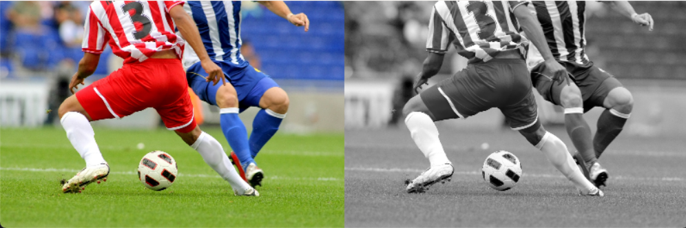
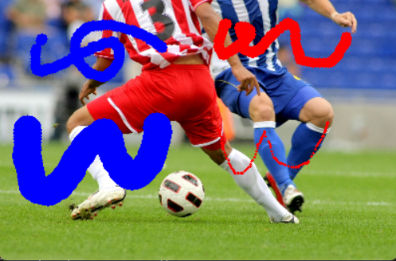
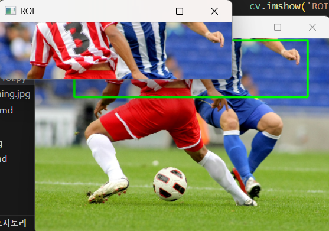

#  OpenCV 실습 모음 (Chapter 01)

---

## 01. 이미지 불러오기 및 그레이스케일 변환

> **설명**
> - 이미지를 불러와 원본과 그레이스케일 이미지를 나란히 출력합니다.
> - BGR → Grayscale 변환, np.hstack으로 결합, 창에 표시 후 키 입력 시 종료

**핵심 개념 및 자세한 설명**
- **이미지 입출력**: 컴퓨터 비전에서 이미지를 다루려면 먼저 파일을 읽어와야 합니다. OpenCV의 `cv.imread()` 함수는 이미지 파일을 읽어와 배열로 변환합니다. `cv.imshow()`는 이 배열을 실제 화면에 보여줍니다.
- **그레이스케일(Grayscale)이란?**
    - 그레이스케일 이미지는 색상 정보 없이 밝기 정보만을 가진 흑백 이미지입니다. 각 픽셀은 0(검정)~255(흰색) 사이의 값으로 표현됩니다.
    - 일반적으로 컬러 이미지는 빨강(R), 초록(G), 파랑(B) 3개의 채널로 구성되지만 그레이스케일은 단일 채널로 밝기만 저장합니다.
    - 그레이스케일 변환은 `cv.cvtColor(img, cv.COLOR_BGR2GRAY)`로 수행하며 이는 각 픽셀의 색상값을 밝기값으로 변환하는 과정입니다.
    - 그레이스케일 이미지는 컴퓨터가 이미지의 구조나 패턴을 더 쉽게 분석할 수 있게 해줍니다(예: 엣지 검출, 객체 인식 등).
- **이미지 결합**: 여러 이미지를 한 화면에 나란히 보여주고 싶을 때 NumPy의 `np.hstack()`을 사용해 이미지를 가로로 이어붙일 수 있습니다.
- **예외 처리**: 이미지 파일이 없거나 경로가 잘못되면 프로그램이 오류 없이 종료되도록 체크합니다.
- **리사이즈**: 이미지가 너무 크면 화면에 다 나오지 않으므로, 적당한 크기로 줄여서 출력합니다.

<details>
<summary><b>전체 코드 (주석 포함)</b></summary>

```python
import cv2 as cv  # OpenCV 라이브러리 임포트
import numpy as np  # NumPy 라이브러리 임포트

img = cv.imread('soccer.jpg')  # 이미지를 BGR 형식으로 읽어옴
if img is None:
    print('이미지를 찾을 수 없습니다.')  # 이미지가 없으면 에러 메시지 출력
    exit()  # 프로그램 종료

max_width = 600  # 최대 가로 크기 
max_height = 600  # 최대 세로 크기
h, w = img.shape[:2]  # 원본 이미지의 세로, 가로 크기 추출
scale = min(max_width / w, max_height / h)  # 비율 계산 (가로, 세로 중 작은 값 기준)
new_w = int(w * scale)  # 리사이즈할 가로 크기
new_h = int(h * scale)  # 리사이즈할 세로 크기
img_resized = cv.resize(img, (new_w, new_h))  # 이미지 리사이즈

gray = cv.cvtColor(img_resized, cv.COLOR_BGR2GRAY)  # BGR 이미지를 그레이스케일로 변환
gray_bgr = cv.cvtColor(gray, cv.COLOR_GRAY2BGR)  # 그레이스케일 이미지를 BGR로 변환 (hstack을 위해)

result = np.hstack((img_resized, gray_bgr))  # 두 이미지를 가로로 이어붙임
cv.imshow('Original | Grayscale', result)  # 창 이름과 이미지를 지정하여 출력
cv.waitKey(0)  # 아무 키나 누를 때까지 대기
cv.destroyAllWindows()  # 모든 OpenCV 창 닫기
```
</details>

**핵심 코드**
```python
img = cv.imread('soccer.jpg')
gray = cv.cvtColor(img, cv.COLOR_BGR2GRAY)
gray_bgr = cv.cvtColor(gray, cv.COLOR_GRAY2BGR)
result = np.hstack((img, gray_bgr))
cv.imshow('Original | Grayscale', result)
cv.waitKey(0)
cv.destroyAllWindows()
```

**결과물**
<figure>
  
  <figcaption>원본과 그레이스케일 이미지가 나란히 출력된 결과</figcaption>
</figure>

---

## 02. 페인팅 붓 크기 조절

> **설명**
> - 마우스 입력으로 이미지 위에 붓질, 키보드로 붓 크기 조절
> - 좌클릭: 파란색, 우클릭: 빨간색, 드래그로 연속 그리기, +/– 키로 크기 조절, q로 종료

**핵심 개념 및 자세한 설명**
- **마우스 이벤트란?**
    - 사용자가 마우스로 그림을 그릴 수 있도록 OpenCV의 `cv.setMouseCallback()`을 사용해 마우스 클릭/드래그 이벤트를 처리합니다.
    - 마우스 이벤트는 클릭(버튼 누름), 이동, 버튼 뗌 등 다양한 동작을 감지할 수 있습니다.
    - 예를 들어, 좌클릭하면 파란색 붓, 우클릭하면 빨간색 붓으로 그림을 그릴 수 있습니다.
    - 드래그(클릭한 채로 이동)하면 선이 이어지듯 연속적으로 그림이 그려집니다.
- **키보드 이벤트**: `cv.waitKey()`로 키 입력을 받아 붓 크기를 조절하거나 창을 종료합니다. +, - 키로 붓 크기를 조절할 수 있습니다.
- **그림 그리기**: `cv.circle()`로 마우스 위치에 붓 크기만큼 원을 그려서 페인팅 효과를 만듭니다. 이 원들이 모여서 선이나 도형처럼 보입니다.
- **이미지 생성**: `np.ones()`로 흰색 배경 이미지를 만들어 캔버스로 사용합니다.
- **상태 관리**: 붓질 중인지, 어떤 색을 사용할지, 붓 크기는 얼마인지 변수로 관리합니다.

<details>
<summary><b>전체 코드 (주석 포함)</b></summary>

```python
import cv2 as cv  # OpenCV 라이브러리 임포트
import numpy as np  # NumPy 라이브러리 임포트

img = cv.imread('soccer.jpg')  # 이미지를 불러옴
brush_size = 5  # 초기 붓 크기
max_brush = 15  # 붓 크기 최대값
min_brush = 1   # 붓 크기 최소값
painting = False  # 드래그 상태(붓질 중인지 여부)
color = (255, 0, 0)  # 기본 파란색 (BGR)

def draw(event, x, y, flags, param):  # 마우스 이벤트 콜백 함수 정의
    global painting, color, img, brush_size
    if event == cv.EVENT_LBUTTONDOWN:  # 좌클릭 시작
        painting = True
        color = (255, 0, 0)  # 파란색 선택
        cv.circle(img, (x, y), brush_size, color, -1)  # 현재 위치에 붓 크기만큼 원 그림
    elif event == cv.EVENT_RBUTTONDOWN:  # 우클릭 시작
        painting = True
        color = (0, 0, 255)  # 빨간색 선택
        cv.circle(img, (x, y), brush_size, color, -1)  # 현재 위치에 붓 크기만큼 원 그림
    elif event == cv.EVENT_MOUSEMOVE and painting:  # 마우스 이동 중 붓질
        cv.circle(img, (x, y), brush_size, color, -1)  # 드래그 중이면 계속 그림
    elif event == cv.EVENT_LBUTTONUP or event == cv.EVENT_RBUTTONUP:  # 클릭 해제
        painting = False  # 붓질 종료

cv.namedWindow('Paint')  # 'Paint'라는 이름의 창 생성
cv.setMouseCallback('Paint', draw)  # 마우스 이벤트 콜백 등록

while True:
    cv.imshow('Paint', img)  # 이미지를 창에 표시
    key = cv.waitKey(1) & 0xFF  # 키 입력 대기 및 값 읽기
    if key == ord('q'):  # q 키 입력 시
        break  # 루프 종료 및 창 닫기
    elif key == ord('+') or key == ord('='):  # + 또는 = 키 입력 시
        brush_size = min(max_brush, brush_size + 1)  # 붓 크기 1 증가 (최대 15)
    elif key == ord('-'):  # - 키 입력 시
        brush_size = max(min_brush, brush_size - 1)  # 붓 크기 1 감소 (최소 1)
cv.destroyAllWindows()  # 모든 OpenCV 창 닫기
```
</details>

**핵심 코드**
```python
cv.circle(img, (x, y), brush_size, color, -1)
cv.setMouseCallback('Paint', draw)
cv.waitKey(1)
```

**결과물**
<figure>
  
  <figcaption>마우스로 직접 그린 그림 예시</figcaption>
</figure>

---

## 03. 마우스로 영역 선택 및 ROI 추출

> **설명**
> - 이미지를 불러오고, 마우스로 드래그하여 관심영역(ROI)을 선택
> - 선택한 영역만 따로 저장하거나 표시, r로 리셋, s로 저장

**핵심 개념 및 자세한 설명**
- **ROI(Region of Interest, 관심영역)란?**
    - ROI는 이미지에서 사용자가 특별히 관심을 가지는 부분(영역)을 의미합니다. 예를 들어, 사진에서 얼굴만 잘라내고 싶을 때 ROI를 지정합니다.
    - ROI 추출은 이미지 분석, 객체 인식, OCR 등 다양한 컴퓨터 비전 분야에서 매우 중요하게 사용됩니다.
- **마우스 이벤트**: 사용자가 이미지를 클릭하고 드래그해서 원하는 영역을 선택할 수 있도록 이벤트를 처리합니다.
    - 드래그 중인 영역을 실시간으로 사각형으로 표시해 사용자가 선택 범위를 직관적으로 볼 수 있습니다.
- **ROI 추출 원리**: 선택한 영역의 좌표를 이용해 numpy 슬라이싱으로 해당 부분만 잘라냅니다. 예를 들어, `roi = img[y1:y2, x1:x2]`처럼 사용합니다.
- **이미지 저장**: 선택한 ROI 이미지를 파일로 저장할 수 있습니다(`cv.imwrite()`).
- **리셋 기능**: r 키를 누르면 선택을 초기화하고 다시 선택할 수 있습니다.

<details>
<summary><b>전체 코드 (주석 포함)</b></summary>

```python
import cv2 as cv  # OpenCV 라이브러리 임포트
import numpy as np  # NumPy 라이브러리 임포트

img = cv.imread('soccer.jpg')  # 이미지를 불러옴
if img is None:
    print('이미지를 찾을 수 없습니다.')  # 이미지가 없으면 에러 메시지 출력
    exit()  # 프로그램 종료

max_width = 600  # 최대 가로 크기 (더 크게)
max_height = 600  # 최대 세로 크기 (더 크게)
h, w = img.shape[:2]  # 원본 이미지의 세로, 가로 크기 추출
scale = min(max_width / w, max_height / h)  # 비율 계산 (가로, 세로 중 작은 값 기준)
new_w = int(w * scale)  # 리사이즈할 가로 크기
new_h = int(h * scale)  # 리사이즈할 세로 크기
img = cv.resize(img, (new_w, new_h))  # 이미지 리사이즈

clone = img.copy()  # 원본 이미지 복사본 생성
roi = None  # ROI(관심영역) 변수
selecting = False  # 영역 선택 중 여부
start_point = (-1, -1)  # 선택 시작점
end_point = (-1, -1)    # 선택 끝점

def select_roi(event, x, y, flags, param):  # 마우스 이벤트 콜백 함수 정의
    global start_point, end_point, selecting, roi, img
    if event == cv.EVENT_LBUTTONDOWN:  # 마우스 좌클릭 시작
        start_point = (x, y)  # 시작점 저장
        selecting = True  # 선택 중 상태로 변경
        end_point = (x, y)  # 끝점도 초기화
    elif event == cv.EVENT_MOUSEMOVE and selecting:  # 드래그 중
        end_point = (x, y)  # 끝점 갱신
    elif event == cv.EVENT_LBUTTONUP:  # 마우스 좌클릭 해제
        end_point = (x, y)  # 끝점 저장
        selecting = False  # 선택 종료
        x1, y1 = start_point  # 시작점 좌표
        x2, y2 = end_point    # 끝점 좌표
        x1, x2 = sorted([x1, x2])  # 좌표 정렬
        y1, y2 = sorted([y1, y2])  # 좌표 정렬
        roi = clone[y1:y2, x1:x2]  # ROI 추출

cv.namedWindow('Image')  # 이미지 창 생성
cv.setMouseCallback('Image', select_roi)  # 마우스 이벤트 콜백 등록

while True:
    display_img = clone.copy()  # 이미지 복사본 준비
    if selecting or (start_point != (-1, -1) and end_point != (-1, -1)):
        cv.rectangle(display_img, start_point, end_point, (0, 255, 0), 2)  # 선택 영역 시각화
    cv.imshow('Image', display_img)  # 이미지 출력
    if roi is not None:
        cv.imshow('ROI', roi)  # ROI가 있으면 별도 창에 출력
    key = cv.waitKey(1) & 0xFF  # 키 입력 대기 및 값 읽기
    if key == ord('q'):  # q 키로 종료
        break  # 루프 종료 및 창 닫기
    elif key == ord('r'):  # r 키로 선택 리셋
        start_point = (-1, -1)  # 시작점 초기화
        end_point = (-1, -1)    # 끝점 초기화
        roi = None  # ROI 초기화
        clone = img.copy()  # 이미지 복원
        cv.destroyWindow('ROI')  # ROI 창 닫기
    elif key == ord('s') and roi is not None:  # s 키로 ROI 저장
        cv.imwrite('roi.jpg', roi)  # ROI 이미지를 파일로 저장
        print('ROI가 roi.jpg로 저장되었습니다.')  # 저장 메시지 출력
cv.destroyAllWindows()  # 모든 창 닫기
```
</details>

**핵심 코드**
```python
cv.setMouseCallback('Image', select_roi)
cv.rectangle(display_img, start_point, end_point, (0, 255, 0), 2)
roi = clone[y1:y2, x1:x2]
cv.imwrite('roi.jpg', roi)
```

**결과물**
<div style="display:flex;gap:24px;align-items:center;">
  <figure>
    
    <figcaption>전체 이미지</figcaption>
  </figure>
  <figure>
    
    <figcaption>선택된 ROI </figcaption>
  </figure>
</div>

---

