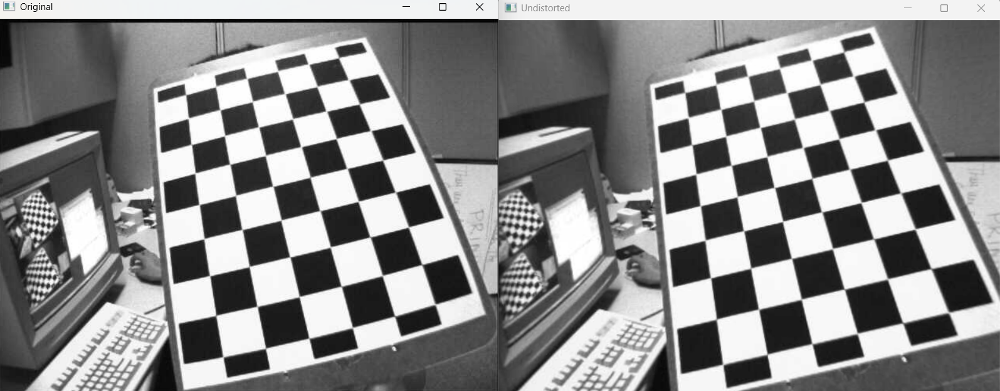
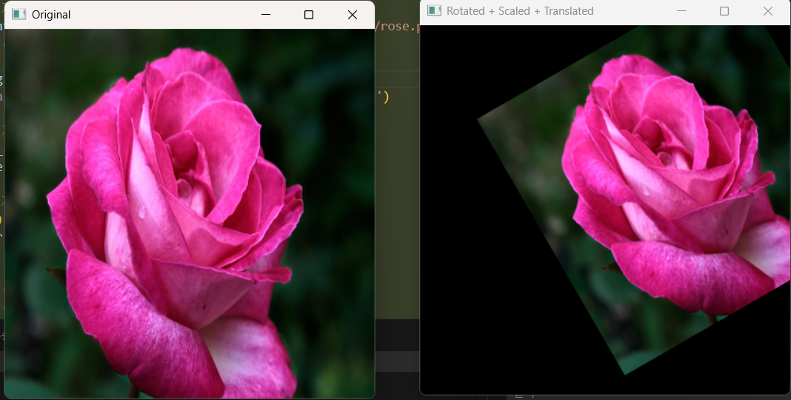
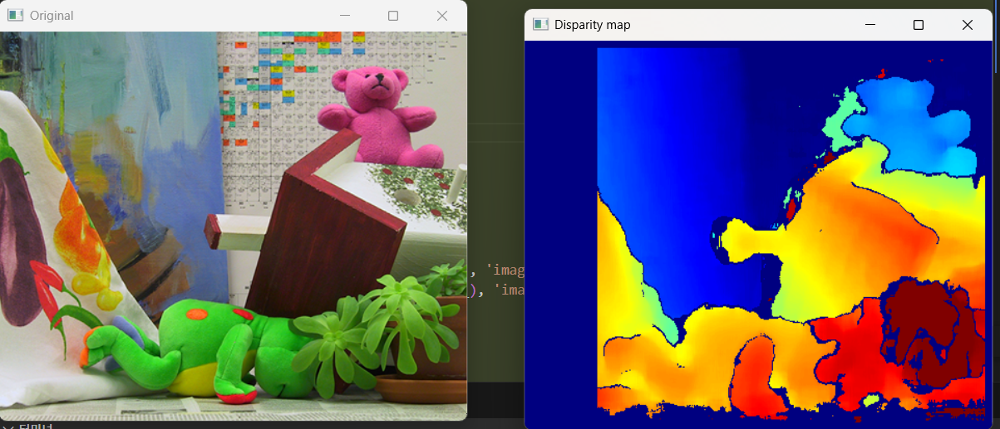

# OpenCV 실습 모음 (Chapter 02)

---

## 01. 카메라 캘리브레이션 (01.Calibration.py)

> **문제 설명**
> - checkerboard 이미지를 사용하여 카메라 내부 파라미터(행렬, 왜곡 계수)를 추정합니다.
> - 코너 검출, 캘리브레이션, 왜곡 보정 과정을 시각적으로 확인합니다.

**핵심 개념 및 자세한 설명**
- **체커보드 코너 검출**: cv2.findChessboardCorners로 각 이미지에서 코너를 검출합니다.
- **카메라 캘리브레이션**: cv2.calibrateCamera로 내부 파라미터와 왜곡 계수를 계산합니다.
- **왜곡 보정**: cv2.undistort로 왜곡된 이미지를 보정합니다.

<details>
<summary><b>전체 코드 (주석 포함)</b></summary>

```python
import cv2  # OpenCV 라이브러리 임포트
import numpy as np  # numpy 임포트
import glob  # 파일 패턴 검색을 위한 glob 임포트
import os  # OS 경로 처리를 위한 os 임포트

# 체커보드 내부 코너 개수
CHECKERBOARD = (9, 6)  # 체커보드의 내부 코너 개수
# 체커보드 한 칸의 실제 크기 (mm)
SQUARE_SIZE = 25.0  # mm, 한 칸의 실제 크기

# 코너 정밀화 조건
criteria = (cv2.TERM_CRITERIA_EPS + cv2.TERM_CRITERIA_MAX_ITER, 30, 0.001)  # 코너 정밀화 조건
# 실제 좌표 생성
objp = np.zeros((CHECKERBOARD[0]*CHECKERBOARD[1], 3), np.float32)  # 3D 좌표 배열 생성
objp[:, :2] = np.mgrid[0:CHECKERBOARD[0], 0:CHECKERBOARD[1]].T.reshape(-1, 2)  # 격자 구조 생성
objp *= SQUARE_SIZE  # 실제 크기 반영

# 3D 실제 좌표 저장 리스트
objpoints = []  # 3D 실제 좌표
# 2D 이미지 좌표 저장 리스트
imgpoints = []  # 2D 이미지 좌표

# 이미지 파일 리스트 가져오기
images = glob.glob("images/calibration_images/left*.jpg")  # 체커보드 이미지 파일 리스트

# 이미지 크기 변수
img_size = None  # 이미지 크기 저장 변수

# 1. 체커보드 코너 검출
for fname in images:  # 각 이미지 파일에 대해 반복
	img = cv2.imread(fname)  # 이미지 읽기
	gray = cv2.cvtColor(img, cv2.COLOR_BGR2GRAY)  # 그레이스케일 변환
	if img_size is None:  # 첫 이미지에서 크기 저장
		img_size = gray.shape[::-1]  # (가로, 세로)
	ret, corners = cv2.findChessboardCorners(gray, CHECKERBOARD, None)  # 체커보드 코너 검출
	if ret:  # 검출 성공 시
		corners2 = cv2.cornerSubPix(gray, corners, (11, 11), (-1, -1), criteria)  # 코너 정밀화
		objpoints.append(objp)  # 실제 좌표 저장
		imgpoints.append(corners2)  # 이미지 좌표 저장
		cv2.drawChessboardCorners(img, CHECKERBOARD, corners2, ret)  # 코너 시각화
		cv2.imshow('Corners', img)  # 이미지 출력
		cv2.waitKey(300)  # 잠시 대기
cv2.destroyAllWindows()  # 모든 윈도우 닫기

# 코너 검출 실패 시
if len(objpoints) == 0:  # 코너 검출 실패 시
	print('체커보드 코너를 검출한 이미지가 없습니다.')  # 경고 출력
	exit()  # 프로그램 종료

# 2. 카메라 캘리브레이션
ret, K, dist, rvecs, tvecs = cv2.calibrateCamera(objpoints, imgpoints, img_size, None, None)  # 카메라 파라미터 계산
print('Camera Matrix K:')  # 내부 행렬 출력
print(K)  # 내부 행렬 값 출력
print('\nDistortion Coefficients:')  # 왜곡 계수 출력
print(dist)  # 왜곡 계수 값 출력

# 3. 왜곡 보정 시각화
for fname in images:  # 각 이미지에 대해 반복
	img = cv2.imread(fname)  # 이미지 읽기
	undistorted = cv2.undistort(img, K, dist, None, K)  # 왜곡 보정
	cv2.imshow('Original', img)  # 원본 이미지 출력
	cv2.imshow('Undistorted', undistorted)  # 보정 이미지 출력
	cv2.waitKey(500)  # 잠시 대기
cv2.destroyAllWindows()  # 모든 윈도우 닫기
```
</details>

**핵심 코드**
```python
ret, K, dist, rvecs, tvecs = cv2.calibrateCamera(objpoints, imgpoints, img_size, None, None)
undistorted = cv2.undistort(img, K, dist, None, K)
```
## 결과물

<div style="display: flex; flex-direction: row; gap: 20px;">
  <div style="text-align: center;">
	<b>01. Calibration 결과</b><br>
	
  </div>
---

## 02. 이미지 변환 (02_image_transform.py)

> **문제 설명**
> - 이미지를 회전, 크기 조절, 평행이동하여 변환된 결과를 시각화합니다.
> - 변환된 이미지를 모니터 중앙에 배치합니다.

**핵심 개념 및 자세한 설명**
- **이미지 회전/스케일/이동**: cv2.getRotationMatrix2D로 회전 행렬을 만들고, cv2.warpAffine으로 변환을 적용합니다.
- **윈도우 위치 조정**: cv2.moveWindow로 결과 이미지를 화면 중앙에 배치합니다.

<details>
<summary><b>전체 코드 (주석 포함)</b></summary>

```python
import cv2  # OpenCV 라이브러리 임포트
import numpy as np  # numpy 임포트
import os  # OS 경로 처리를 위한 os 임포트

# 이미지 파일 경로 설정
img_path = os.path.join(os.path.dirname(__file__), 'images/rose.png')  # 이미지 경로 생성
img = cv2.imread(img_path)  # 이미지 읽기

if img is None:
	raise FileNotFoundError('이미지 파일을 찾을 수 없습니다.')  # 파일 없을 때 예외 처리

# 이미지 크기를 400x400으로 고정
fixed_size = (400, 400)  # 고정 크기 설정
img_resized = cv2.resize(img, fixed_size)  # 이미지 리사이즈

# 이미지 중심 계산
(h, w) = fixed_size  # 높이, 너비
center = (w // 2, h // 2)  # 중심 좌표

# 회전 + 크기 조절
angle = 30  # +30도 회전
scale = 0.8  # 크기 0.8로 조절
M = cv2.getRotationMatrix2D(center, angle, scale)  # 회전 행렬 생성

# 평행이동 적용 (x축 +80, y축 -40)
M[0, 2] += 80  # x축 이동
M[1, 2] += -40  # y축 이동

# 변환 적용
rotated_scaled_translated = cv2.warpAffine(img_resized, M, fixed_size)  # 변환 적용

# 결과 시각화
cv2.imshow('Original', img_resized)  # 원본 이미지 출력
cv2.imshow('Rotated + Scaled + Translated', rotated_scaled_translated)  # 변환 이미지 출력

# 윈도우를 모니터 중앙에 위치시키기
screen_res = 1920, 1080  # 일반적인 모니터 해상도, 필요시 변경
win_w, win_h = fixed_size  # 윈도우 크기
center_x = screen_res[0] // 2 - win_w // 2  # 중앙 x좌표
center_y = screen_res[1] // 2 - win_h // 2  # 중앙 y좌표
cv2.moveWindow('Original', center_x - win_w - 20, center_y)  # 원본 윈도우 위치
cv2.moveWindow('Rotated + Scaled + Translated', center_x + win_w + 20, center_y)  # 변환 윈도우 위치

cv2.waitKey(0)  # 키 입력 대기
cv2.destroyAllWindows()  # 모든 윈도우 닫기
```
</details>

**핵심 코드**
```python
M = cv2.getRotationMatrix2D(center, angle, scale)
rotated_scaled_translated = cv2.warpAffine(img_resized, M, fixed_size)
```
## 결과물

<div style="display: flex; flex-direction: row; gap: 20px;">
  <div style="text-align: center;">
	<b>02_image_transform 결과</b><br>
	
  </div>
---

## 03. 스테레오 Depth 계산 (03.Depth.py)

> **문제 설명**
> - 좌/우 스테레오 이미지를 이용해 disparity map과 depth map을 계산합니다.
> - ROI 영역별 평균 disparity, depth를 구하고 가장 가까운/먼 영역을 판별합니다.

**핵심 개념 및 자세한 설명**
- **스테레오 매칭**: cv2.StereoBM_create로 disparity map을 계산합니다.
- **Depth 계산**: disparity 값을 이용해 각 픽셀의 depth를 계산합니다.
- **ROI 분석**: 지정된 영역별 평균 disparity, depth를 구해 비교합니다.

<details>
<summary><b>전체 코드 (주석 포함)</b></summary>

```python
import cv2  # OpenCV 라이브러리 임포트
import numpy as np  # numpy 임포트
import os  # OS 경로 처리를 위한 os 임포트

# 카메라 파라미터 설정
f = 700.0  # focal length (초점 거리)
B = 0.12   # baseline (두 카메라 사이 거리, m)

# ROI 영역 정의
rois = {
	"Painting": (55, 50, 130, 110),  # 그림 영역
	"Frog": (90, 265, 230, 95),      # 개구리 영역
	"Teddy": (310, 35, 115, 90)      # 곰인형 영역
}

# 이미지 경로 설정
left_path = os.path.join(os.path.dirname(__file__), 'images/left.png')  # 좌측 이미지 경로
right_path = os.path.join(os.path.dirname(__file__), 'images/right.png')  # 우측 이미지 경로

# 이미지 읽기
left_img = cv2.imread(left_path)  # 좌측 이미지 읽기
right_img = cv2.imread(right_path)  # 우측 이미지 읽기

# 이미지가 없을 경우 예외 처리
if left_img is None or right_img is None:
	raise FileNotFoundError('좌/우 이미지를 찾을 수 없습니다.')  # 이미지 없을 때 예외 처리

# 그레이스케일 변환
left_gray = cv2.cvtColor(left_img, cv2.COLOR_BGR2GRAY)  # 좌측 그레이스케일 변환
right_gray = cv2.cvtColor(right_img, cv2.COLOR_BGR2GRAY)  # 우측 그레이스케일 변환

# StereoBM으로 disparity map 계산
stereo = cv2.StereoBM_create(numDisparities=64, blockSize=15)  # StereoBM 객체 생성
disparity = stereo.compute(left_gray, right_gray).astype(np.float32) / 16.0  # disparity 계산 및 스케일 조정

# Disparity > 0인 픽셀만 depth 계산
valid_mask = disparity > 0  # 유효 disparity 마스크

# depth map 초기화 및 계산
depth_map = np.zeros_like(disparity)  # depth map 초기화
depth_map[valid_mask] = f * B / disparity[valid_mask]  # depth 계산

# ROI별 평균 disparity, depth 계산
results = {}  # 결과 저장 딕셔너리
for name, (x, y, w, h) in rois.items():  # 각 ROI에 대해 반복
	roi_disp = disparity[y:y+h, x:x+w]  # ROI 내 disparity 추출
	roi_depth = depth_map[y:y+h, x:x+w]  # ROI 내 depth 추출
	roi_mask = roi_disp > 0  # 유효 disparity 마스크
	mean_disp = np.mean(roi_disp[roi_mask]) if np.any(roi_mask) else np.nan  # 평균 disparity 계산
	mean_depth = np.mean(roi_depth[roi_mask]) if np.any(roi_mask) else np.nan  # 평균 depth 계산
	results[name] = {'mean_disp': mean_disp, 'mean_depth': mean_depth}  # 결과 저장

# 가장 가까운/먼 ROI 찾기
closest_roi = min(results, key=lambda k: results[k]['mean_depth'])  # 가장 가까운 ROI (depth가 가장 작음)
farthest_roi = max(results, key=lambda k: results[k]['mean_depth'])  # 가장 먼 ROI (depth가 가장 큼)

# 결과 출력
print('ROI별 평균 disparity, depth:')  # ROI별 평균 disparity, depth 출력
for name, vals in results.items():
	print(f"{name}: disparity={vals['mean_disp']:.2f}, depth={vals['mean_depth']:.2f}")  # 각 ROI별 값 출력
print(f"\n가장 가까운 ROI: {closest_roi}")  # 가장 가까운 ROI 출력
print(f"가장 먼 ROI: {farthest_roi}")  # 가장 먼 ROI 출력

# Disparity map 시각화
disp_vis = np.zeros_like(disparity, dtype=np.uint8)  # 시각화용 배열 초기화
if np.any(valid_mask):  # 유효 disparity가 있을 때
	d_min = np.nanpercentile(disparity[valid_mask], 5)  # 최소값 계산
	d_max = np.nanpercentile(disparity[valid_mask], 95)  # 최대값 계산
	disp_scaled = (disparity - d_min) / (d_max - d_min)  # 정규화
	disp_scaled = np.clip(disp_scaled, 0, 1)  # 범위 제한
	disp_vis[valid_mask] = (disp_scaled[valid_mask] * 255).astype(np.uint8)  # 0~255 변환
color_disp = cv2.applyColorMap(disp_vis, cv2.COLORMAP_JET)  # 컬러맵 적용

# 결과 시각화
cv2.imshow('Original', left_img)  # 원본 이미지 출력
cv2.imshow('Disparity map', color_disp)  # disparity map 출력
cv2.waitKey(0)  # 키 입력 대기
cv2.destroyAllWindows()  # 모든 윈도우 닫기
```
</details>

**핵심 코드**
```python
stereo = cv2.StereoBM_create(numDisparities=64, blockSize=15)
disparity = stereo.compute(left_gray, right_gray).astype(np.float32) / 16.0
depth_map[valid_mask] = f * B / disparity[valid_mask]
```

---

## 결과물

<div style="display: flex; flex-direction: row; gap: 20px;">
  <div style="text-align: center;">
	<b>03. Depth 결과</b><br>
	
  </div>
</div>

