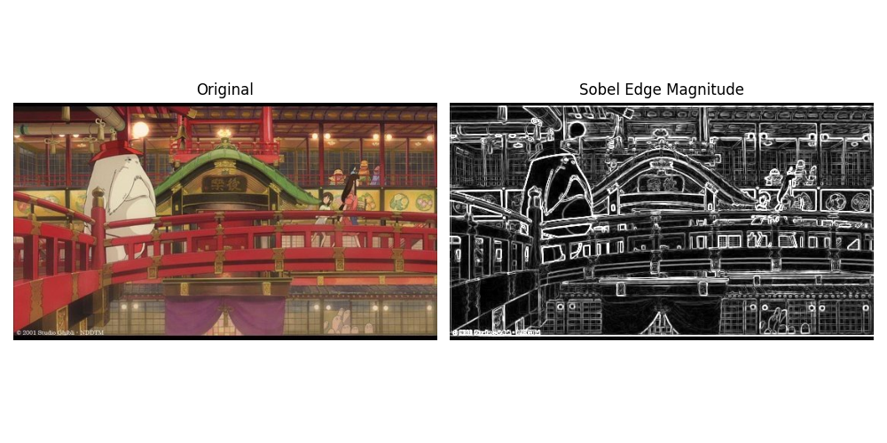
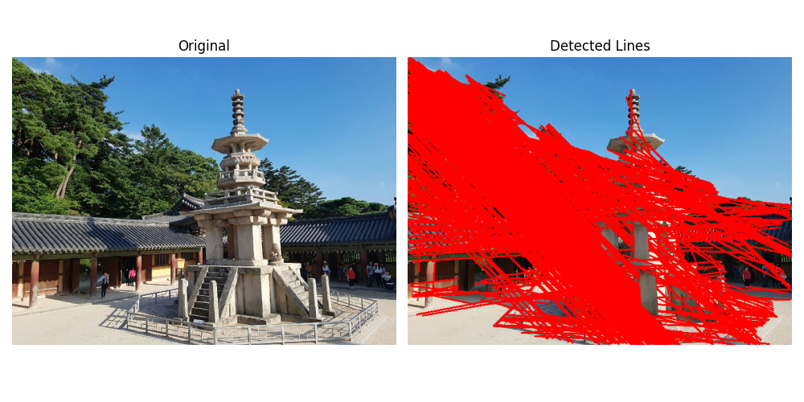
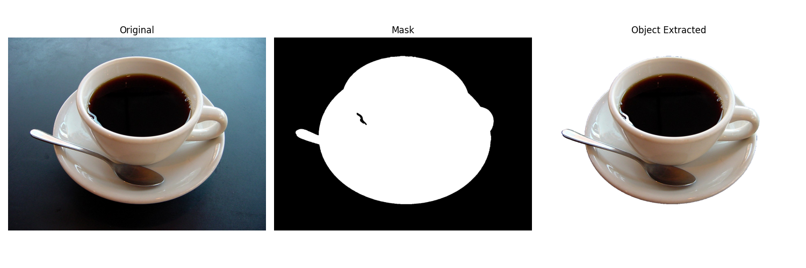

# OpenCV 실습 모음 (Chapter 03)

---

## 01. 소벨 에지 검출 (01_sobel_edge_detection.py)

> **문제 설명**
> - 이미지를 그레이스케일로 변환한 뒤, 소벨(Sobel) 필터를 사용하여 x축과 y축 방향의 에지를 검출합니다.
> - 검출된 에지 강도 이미지를 시각화합니다.

**핵심 개념 및 자세한 설명**
- **그레이스케일 변환**: cv2.cvtColor로 이미지를 흑백으로 변환합니다.
- **소벨 에지 검출**: cv2.Sobel로 x, y 방향 에지를 각각 검출합니다.
- **에지 강도 계산**: cv2.magnitude로 두 방향의 에지로부터 최종 에지 강도를 계산합니다.
- **uint8 변환**: cv2.convertScaleAbs로 시각화용으로 변환합니다.

</details>
<summary><b>전체 코드 (주석 포함)</b></summary>

```python
import cv2 as cv  # OpenCV 라이브러리 임포트
import numpy as np  # numpy 임포트
import matplotlib.pyplot as plt  # 시각화용 matplotlib 임포트

# 이미지 파일 경로 지정
gray_img_path = 'C:/computervision/chapter03/edgeDetectionImage.jpg'  # 사용할 이미지 경로
# 이미지 읽기 (BGR 형식)
img = cv.imread(gray_img_path)
# 이미지가 없으면 에러 발생
if img is None:
  raise FileNotFoundError(f"이미지를 찾을 수 없습니다: {gray_img_path}")

# 이미지를 그레이스케일로 변환
gray = cv.cvtColor(img, cv.COLOR_BGR2GRAY)
# 소벨 필터로 x축 방향 에지 검출
sobelx = cv.Sobel(gray, cv.CV_64F, 1, 0, ksize=3)
# 소벨 필터로 y축 방향 에지 검출
sobely = cv.Sobel(gray, cv.CV_64F, 0, 1, ksize=3)
# x, y 방향 에지로부터 에지 강도 계산
magnitude = cv.magnitude(sobelx, sobely)
# 에지 강도 이미지를 uint8로 변환
edge_img = cv.convertScaleAbs(magnitude)

# 결과 시각화 (원본, 에지 강도)
plt.figure(figsize=(10, 5))  # 전체 그림 크기
plt.subplot(1, 2, 1)  # 첫 번째(원본)
plt.title('Original')
plt.imshow(cv.cvtColor(img, cv.COLOR_BGR2RGB))  # BGR→RGB 변환
plt.axis('off')  # 축 숨김
plt.subplot(1, 2, 2)  # 두 번째(에지 강도)
plt.title('Sobel Edge Magnitude')
plt.imshow(edge_img, cmap='gray')  # 흑백으로 표시
plt.axis('off')
plt.tight_layout()  # 레이아웃 자동 조정
plt.show()  # 화면에 출력
```
</details>

**핵심 코드**
```python
gray = cv.cvtColor(img, cv.COLOR_BGR2GRAY)
sobelx = cv.Sobel(gray, cv.CV_64F, 1, 0, ksize=3)
sobely = cv.Sobel(gray, cv.CV_64F, 0, 1, ksize=3)
magnitude = cv.magnitude(sobelx, sobely)
edge_img = cv.convertScaleAbs(magnitude)
```
## 결과물

<div style="display: flex; flex-direction: row; gap: 20px;">
  <div style="text-align: center;">
	<b>01. Sobel Edge 결과</b><br>
	
  </div>
</div>

---

## 02. 캐니+허프 직선 검출 (02_canny_hough_lines.py)

> **문제 설명**
> - dabo 이미지를 사용하여 캐니(Canny) 에지 검출로 에지맵을 생성합니다.
> - 허프 변환(Hough Transform)으로 이미지에서 직선을 검출하고, 원본 이미지에 빨간색으로 표시합니다.

**핵심 개념 및 자세한 설명**
- **캐니 에지 검출**: cv2.Canny로 에지맵을 생성합니다.
- **허프 직선 검출**: cv2.HoughLinesP로 직선을 검출합니다.
- **직선 그리기**: cv2.line으로 원본 이미지에 빨간색(0,0,255) 직선을 그림.

</details>
<summary><b>전체 코드 (주석 포함)</b></summary>

```python
import cv2 as cv  # OpenCV 라이브러리 임포트
import numpy as np  # numpy 임포트
import matplotlib.pyplot as plt  # 시각화용 matplotlib 임포트

# 이미지 파일 경로 지정
dabo_img_path = 'C:/computervision/chapter03/dabo.jpg'  # 사용할 이미지 경로
# 이미지 읽기 (BGR 형식)
img = cv.imread(dabo_img_path)
# 이미지가 없으면 에러 발생
if img is None:
  raise FileNotFoundError(f"이미지를 찾을 수 없습니다: {dabo_img_path}")

# 캐니 에지 검출 (threshold1=100, threshold2=200)
edges = cv.Canny(img, 100, 200)
# 허프 변환을 이용한 직선 검출 (더 많은 직선 검출을 위해 파라미터 조정)
lines = cv.HoughLinesP(edges, rho=1, theta=np.pi/180, threshold=80, minLineLength=60, maxLineGap=20)
# 원본 이미지 복사 (직선 표시용)
img_lines = img.copy()
# 검출된 직선이 있으면 반복하며 그림
if lines is not None:
  for line in lines:
    x1, y1, x2, y2 = line[0]  # 직선의 양 끝점 좌표
    cv.line(img_lines, (x1, y1), (x2, y2), (0, 0, 255), 2)  # 빨간색, 두께 2

# 결과 시각화 (원본, 직선 검출 결과만)
plt.figure(figsize=(10, 5))  # 전체 그림 크기
plt.subplot(1, 2, 1)  # 첫 번째(원본)
plt.title('Original')
plt.imshow(cv.cvtColor(img, cv.COLOR_BGR2RGB))  # BGR→RGB 변환
plt.axis('off')  # 축 숨김

plt.subplot(1, 2, 2)  # 두 번째(직선 검출 결과)
plt.title('Detected Lines')
plt.imshow(cv.cvtColor(img_lines, cv.COLOR_BGR2RGB))  # BGR→RGB 변환
plt.axis('off')

plt.tight_layout()  # 레이아웃 자동 조정
plt.show()  # 화면에 출력
```
</details>

**핵심 코드**
```python
edges = cv.Canny(img, 100, 200)
lines = cv.HoughLinesP(edges, rho=1, theta=np.pi/180, threshold=120, minLineLength=120, maxLineGap=20)
if lines is not None:
    for line in lines:
        x1, y1, x2, y2 = line[0]
        cv.line(img_lines, (x1, y1), (x2, y2), (0, 0, 255), 2)
```
## 결과물

<div style="display: flex; flex-direction: row; gap: 20px;">
  <div style="text-align: center;">
	<b>02. Canny+Hough 결과</b><br>
	
  </div>
</div>

---

## 03. GrabCut 객체 추출 (03_grabcut_object_extraction.py)

> **문제 설명**
> - coffee cup 이미지를 사용하여 사용자가 지정한(또는 자동 계산된) 사각형 영역을 바탕으로 GrabCut 알고리즘으로 객체(컵)를 추출합니다.
> - 객체 추출 결과를 마스크와 배경이 제거된 이미지로 시각화합니다.

**핵심 개념 및 자세한 설명**
- **GrabCut 분할**: cv2.grabCut으로 사각형 영역 기반 객체 분할을 수행합니다.
- **마스크 처리**: np.where로 전경/배경을 구분하고, cv2.morphologyEx로 노이즈를 제거합니다.
- **배경 제거**: 마스크를 이용해 원본에서 배경을 흰색으로 만듭니다.

</details>
<summary><b>전체 코드 (주석 포함)</b></summary>

```python
import cv2 as cv  # OpenCV 라이브러리 임포트
import numpy as np  # numpy 임포트
import matplotlib.pyplot as plt  # 시각화용 matplotlib 임포트

# 이미지 파일 경로 지정
coffee_img_path = 'C:/computervision/chapter03/coffee cup.JPG'  # 사용할 이미지 경로
# 이미지 읽기 (BGR 형식)
img = cv.imread(coffee_img_path)
# 이미지가 없으면 에러 발생
if img is None:
  raise FileNotFoundError(f"이미지를 찾을 수 없습니다: {coffee_img_path}")

# 이미지 크기(높이, 너비) 구하기
height, width = img.shape[:2]
# 사각형 너비, 높이를 이미지의 90%로 설정
rect_w = int(width * 0.9)
rect_h = int(height * 0.9)
# 사각형 좌상단 좌표 계산 (중앙 정렬)
rect_x = (width - rect_w) // 2
rect_y = (height - rect_h) // 2
# GrabCut용 사각형 (x, y, w, h)
rect = (rect_x, rect_y, rect_w, rect_h)

# GrabCut 마스크(초기값 0), 배경/전경 모델 초기화
mask = np.zeros(img.shape[:2], np.uint8)  # 마스크(0:배경, 1:전경)
bgdModel = np.zeros((1, 65), np.float64)  # GrabCut 배경 모델
fgdModel = np.zeros((1, 65), np.float64)  # GrabCut 전경 모델

# GrabCut 알고리즘 실행 (10회 반복, 사각형 기반 초기화)
cv.grabCut(img, mask, rect, bgdModel, fgdModel, 10, cv.GC_INIT_WITH_RECT)

# GrabCut 결과 마스크에서 전경/가능성 전경(1), 나머지(0)로 변환
mask2 = np.where((mask == cv.GC_FGD) | (mask == cv.GC_PR_FGD), 1, 0).astype('uint8')
# 모폴로지 연산(열림/닫힘)으로 노이즈 제거 및 경계 보정
kernel = np.ones((5, 5), np.uint8)  # 5x5 커널
mask2 = cv.morphologyEx(mask2, cv.MORPH_OPEN, kernel)  # 작은 잡음 제거
mask2 = cv.morphologyEx(mask2, cv.MORPH_CLOSE, kernel)  # 경계 매끄럽게

# 배경 제거된 결과 이미지 생성 (배경은 흰색)
result = img.copy()  # 원본 복사
result[mask2 == 0] = [255, 255, 255]  # 배경을 흰색으로 설정

# 결과 시각화 (원본, 마스크, 객체 추출)
plt.figure(figsize=(15, 5))  # 전체 그림 크기
plt.subplot(1, 3, 1)  # 첫 번째(원본)
plt.title('Original')
plt.imshow(cv.cvtColor(img, cv.COLOR_BGR2RGB))  # BGR→RGB 변환
plt.axis('off')  # 축 숨김
plt.subplot(1, 3, 2)  # 두 번째(마스크)
plt.title('Mask')
plt.imshow(mask2, cmap='gray')  # 흑백 마스크
plt.axis('off')
plt.subplot(1, 3, 3)  # 세 번째(객체 추출)
plt.title('Object Extracted')
plt.imshow(cv.cvtColor(result, cv.COLOR_BGR2RGB))  # BGR→RGB 변환
plt.axis('off')
plt.tight_layout()  # 레이아웃 자동 조정
plt.show()  # 화면에 출력
```
</details>

**핵심 코드**
```python
rect = (rect_x, rect_y, rect_w, rect_h)
cv.grabCut(img, mask, rect, bgdModel, fgdModel, 10, cv.GC_INIT_WITH_RECT)
mask2 = np.where((mask == cv.GC_FGD) | (mask == cv.GC_PR_FGD), 1, 0).astype('uint8')
result[mask2 == 0] = [255, 255, 255]
```
## 결과물

<div style="display: flex; flex-direction: row; gap: 20px;">
  <div style="text-align: center;">
	<b>03. GrabCut 결과</b><br>
	
  </div>
</div>

---
