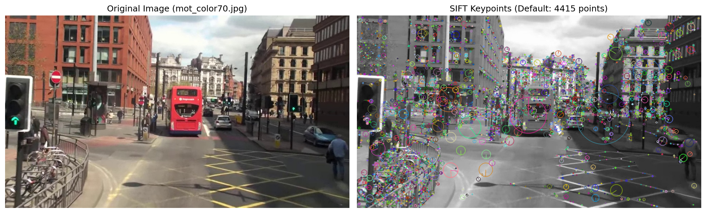
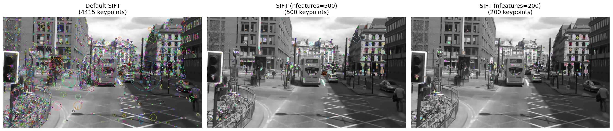
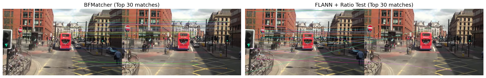
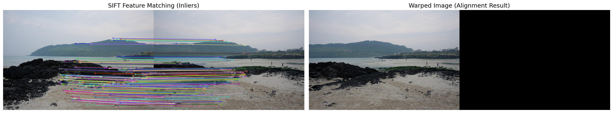

# OpenCV 실습 모음 (Chapter 04)

---

## 01. SIFT 특징점 검출 (01_sift_keypoints.py)

> **문제 설명**
> - 이미지를 SIFT 알고리즘으로 특징점(키포인트)을 검출하고, nfeatures 파라미터에 따라 결과를 비교합니다.
> - 특징점의 위치, 크기, 방향을 시각화합니다.

**핵심 개념 및 자세한 설명**
- **SIFT(Sacle-Invariant Feature Transform)**: 이미지의 크기, 회전에 강인한 특징점 검출 알고리즘
- **nfeatures**: 검출할 최대 특징점 개수 지정
- **cv2.drawKeypoints**: 특징점의 위치, 크기, 방향을 이미지에 시각화
- **matplotlib**: 결과 이미지 시각화 및 저장

<details>
<summary><b>전체 코드 (주석 포함)</b></summary>

```python
import cv2  # OpenCV 라이브러리 임포트 (이미지 처리 기능 제공)
import matplotlib.pyplot as plt  # Matplotlib 임포트 (시각화 기능 제공)
import numpy as np  # NumPy 임포트 (수치 연산 기능 제공)

# 첫 번째 경로에서 이미지 로드 시도
img_path = cv2.imread('chapter04/mot_color70.jpg')
# 이미지 로드 실패 시 현재 디렉토리에서 이미지 로드 시도
if img_path is None:
    img_path = cv2.imread('mot_color70.jpg')

# OpenCV의 BGR 형식 이미지를 matplotlib용 RGB 형식으로 변환
img_rgb = cv2.cvtColor(img_path, cv2.COLOR_BGR2RGB)

# 이미지를 그레이스케일로 변환 (SIFT 알고리즘은 그레이스케일 이미지에서 작동)
img_gray = cv2.cvtColor(img_path, cv2.COLOR_BGR2GRAY)

# ===== SIFT 특징점 검출 =====
# 다양한 nfeatures 값으로 비교를 위해 여러 SIFT 객체 생성

# 1. 기본 SIFT 객체 생성 (특징점 개수 제한 없음)
sift = cv2.SIFT_create()
# 기본 SIFT로 그레이스케일 이미지에서 특징점과 묘사자(descriptor) 검출
keypoints_default, descriptors_default = sift.detectAndCompute(img_gray, None)

# 2. SIFT 객체 생성 (nfeatures=500으로 최대 특징점 개수 제한)
sift_500 = cv2.SIFT_create(nfeatures=500)
# 500개 제한의 SIFT로 특징점과 묘사자 검출
keypoints_500, descriptors_500 = sift_500.detectAndCompute(img_gray, None)

# 3. SIFT 객체 생성 (nfeatures=200으로 최대 특징점 개수 제한)
sift_200 = cv2.SIFT_create(nfeatures=200)
# 200개 제한의 SIFT로 특징점과 묘사자 검출
keypoints_200, descriptors_200 = sift_200.detectAndCompute(img_gray, None)

# 기본 SIFT로 검출된 특징점 개수 출력
print(f"기본 SIFT - 특징점 개수: {len(keypoints_default)}")
# 500개 제한 SIFT로 검출된 특징점 개수 출력
print(f"nfeatures=500 - 특징점 개수: {len(keypoints_500)}")
# 200개 제한 SIFT로 검출된 특징점 개수 출력
print(f"nfeatures=200 - 특징점 개수: {len(keypoints_200)}")

# ===== 특징점 시각화 =====
# 특징점의 방향과 크기를 표시하기 위해 DRAW_MATCHES_FLAGS_DRAW_RICH_KEYPOINTS 사용

# 1. 기본 SIFT 결과를 이미지에 그리기
img_keypoints_default = cv2.drawKeypoints(
    img_gray,  # 그리기를 할 입력 그레이스케일 이미지
    keypoints_default,  # 그릴 특징점 리스트
    None,  # 출력 이미지 (None으로 설정하면 새로 생성)
    flags=cv2.DRAW_MATCHES_FLAGS_DRAW_RICH_KEYPOINTS  # 특징점의 방향과 크기를 표시하는 플래그
)

# 2. nfeatures=500 결과를 이미지에 그리기
img_keypoints_500 = cv2.drawKeypoints(
    img_gray,  # 입력 그레이스케일 이미지
    keypoints_500,  # 특징점 리스트 (500개 제한)
    None,  # 출력 이미지
    flags=cv2.DRAW_MATCHES_FLAGS_DRAW_RICH_KEYPOINTS  # 특징점 시각화 옵션
)

# 3. nfeatures=200 결과를 이미지에 그리기
img_keypoints_200 = cv2.drawKeypoints(
    img_gray,  # 입력 그레이스케일 이미지
    keypoints_200,  # 특징점 리스트 (200개 제한)
    None,  # 출력 이미지
    flags=cv2.DRAW_MATCHES_FLAGS_DRAW_RICH_KEYPOINTS  # 특징점 시각화 옵션
)

# ===== matplotlib을 이용한 시각화 =====

# (1) 원본 이미지 vs 기본 SIFT 특징점 비교 시각화
# 1행 2열의 서브플롯 생성 (크기: 14x6)
fig, axes = plt.subplots(1, 2, figsize=(14, 6))

# 첫 번째 서브플롯에 원본 RGB 이미지 표시
axes[0].imshow(img_rgb)
# 첫 번째 서브플롯의 제목 설정
axes[0].set_title('Original Image (mot_color70.jpg)', fontsize=12)
# 첫 번째 서브플롯의 축 제거
axes[0].axis('off')

# 기본 SIFT 특징점 이미지를 BGR에서 RGB로 변환
img_keypoints_default_rgb = cv2.cvtColor(img_keypoints_default, cv2.COLOR_BGR2RGB)
# 두 번째 서브플롯에 변환된 특징점 이미지 표시
axes[1].imshow(img_keypoints_default_rgb)
# 두 번째 서브플롯의 제목 설정 (특징점 개수 표시)
axes[1].set_title(f'SIFT Keypoints (Default: {len(keypoints_default)} points)', fontsize=12)
# 두 번째 서브플롯의 축 제거
axes[1].axis('off')

# 서브플롯 간의 간격 자동 조정
plt.tight_layout()
# 그래프를 PNG 파일로 저장 (해상도: 150 dpi)
plt.savefig('chapter04/01_sift_default.png', dpi=150, bbox_inches='tight')
# 그래프 화면 표시
plt.show()


# (2) nfeatures 비교 - 3개 결과를 나란히 출력
# 1행 3열의 서브플롯 생성 (크기: 18x6)
fig, axes = plt.subplots(1, 3, figsize=(18, 6))

# 기본 SIFT 결과 이미지를 BGR에서 RGB로 변환
img_kp_default_rgb = cv2.cvtColor(img_keypoints_default, cv2.COLOR_BGR2RGB)
# nfeatures=500 결과 이미지를 BGR에서 RGB로 변환
img_kp_500_rgb = cv2.cvtColor(img_keypoints_500, cv2.COLOR_BGR2RGB)
# nfeatures=200 결과 이미지를 BGR에서 RGB로 변환
img_kp_200_rgb = cv2.cvtColor(img_keypoints_200, cv2.COLOR_BGR2RGB)

# 첫 번째 서브플롯에 기본 SIFT 결과 표시
axes[0].imshow(img_kp_default_rgb)
# 첫 번째 서브플롯의 제목 설정 (특징점 개수 표시)
axes[0].set_title(f'Default SIFT\n({len(keypoints_default)} keypoints)', fontsize=12)
# 첫 번째 서브플롯의 축 제거
axes[0].axis('off')

# 두 번째 서브플롯에 nfeatures=500 결과 표시
axes[1].imshow(img_kp_500_rgb)
# 두 번째 서브플롯의 제목 설정 (특징점 개수 표시)
axes[1].set_title(f'SIFT (nfeatures=500)\n({len(keypoints_500)} keypoints)', fontsize=12)
# 두 번째 서브플롯의 축 제거
axes[1].axis('off')

# 세 번째 서브플롯에 nfeatures=200 결과 표시
axes[2].imshow(img_kp_200_rgb)
# 세 번째 서브플롯의 제목 설정 (특징점 개수 표시)
axes[2].set_title(f'SIFT (nfeatures=200)\n({len(keypoints_200)} keypoints)', fontsize=12)
# 세 번째 서브플롯의 축 제거
axes[2].axis('off')

# 서브플롯 간의 간격 자동 조정
plt.tight_layout()
# 비교 그래프를 PNG 파일로 저장 (해상도: 150 dpi)
plt.savefig('chapter04/01_sift_comparison.png', dpi=150, bbox_inches='tight')
# 그래프 화면 표시
plt.show()

# ===== 특징점 정보 출력 =====
# 구분선과 함께 특징점 정보 출력 섹션 시작
print("\n===== 특징점 정보 =====")
# 첫 5개 특징점 정보를 출력할 섹션 시작
print(f"\n첫 5개 특징점 (기본 SIFT):")
# 기본 SIFT의 첫 5개 특징점에 대해 반복
for i, kp in enumerate(keypoints_default[:5]):
    # 각 특징점의 위치(x, y), 크기, 각도(방향) 정보 출력
    print(f"  {i+1}. 위치: ({kp.pt[0]:.2f}, {kp.pt[1]:.2f}), "
          f"크기: {kp.size:.2f}, 각도: {kp.angle:.2f}°")

# 3가지 방식의 특징점 검출 결과를 비교하는 섹션 시작
print("\n특징점 검출 결과 비교:")
# 기본 SIFT의 특징점 개수 출력
print(f"  기본 SIFT: {len(keypoints_default)} 개")
# nfeatures=500의 특징점 개수와 기본 방식 대비 비율 출력
print(f"  nfeatures=500: {len(keypoints_500)} 개 (원래 대비 {len(keypoints_500)/len(keypoints_default)*100:.1f}%)")
# nfeatures=200의 특징점 개수와 기본 방식 대비 비율 출력
print(f"  nfeatures=200: {len(keypoints_200)} 개 (원래 대비 {len(keypoints_200)/len(keypoints_default)*100:.1f}%)")
```

**핵심 코드**
```python
sift = cv2.SIFT_create()
keypoints, descriptors = sift.detectAndCompute(img_gray, None)
img_keypoints = cv2.drawKeypoints(img_gray, keypoints, None, flags=cv2.DRAW_MATCHES_FLAGS_DRAW_RICH_KEYPOINTS)
```

## 결과물

<div style="display: flex; flex-direction: row; gap: 20px;">
  <div style="text-align: center;">
	
  </div>
  <div style="text-align: center;">
	
  </div>
</div>

---

## 02. SIFT 특징점 매칭 (02_sift_feature_matching.py)

> **문제 설명**
> - 두 이미지에서 SIFT 특징점을 추출하고, BFMatcher와 FLANN 매칭 방법으로 특징점을 매칭합니다.
> - 매칭 결과를 시각화하고, 상위 매칭 쌍의 정보를 출력합니다.

**핵심 개념 및 자세한 설명**
- **BFMatcher**: Brute-Force 방식의 특징점 매칭 (L2 거리, crossCheck)
- **FLANN**: 빠른 근사 최근접 이웃 매칭 (KDTree, knnMatch, ratio test)
- **cv2.drawMatches**: 두 이미지의 매칭 결과 시각화
- **Lowe's ratio test**: 잘못된 매칭을 거르는 필터링 기법

<details>
<summary><b>전체 코드 (주석 포함)</b></summary>

```python
import cv2  # OpenCV 라이브러리 임포트 (컴퓨터 비전 기능 제공)
import matplotlib.pyplot as plt  # Matplotlib 임포트 (시각화 기능 제공)
import numpy as np  # NumPy 임포트 (수치 연산 기능 제공)

# 첫 번째 이미지 파일 경로 설정
img1_path = 'chapter04/mot_color70.jpg'
# 두 번째 이미지 파일 경로 설정
img2_path = 'chapter04/mot_color83.jpg'

# 첫 번째 이미지 읽기 (BGR 형식으로 로드)
img1 = cv2.imread(img1_path)
# 두 번째 이미지 읽기 (BGR 형식으로 로드)
img2 = cv2.imread(img2_path)

# 첫 번째 이미지 로드 실패 시 현재 디렉토리에서 재시도
if img1 is None:
    img1 = cv2.imread('mot_color70.jpg')
# 두 번째 이미지 로드 실패 시 현재 디렉토리에서 재시도
if img2 is None:
    img2 = cv2.imread('mot_color83.jpg')

# 두 이미지 모두 로드 실패 시 에러 메시지 출력 및 프로그램 종료
if img1 is None or img2 is None:
    raise FileNotFoundError('이미지 파일을 찾을 수 없습니다.')

# 첫 번째 이미지를 BGR에서 그레이스케일로 변환 (SIFT용)
img1_gray = cv2.cvtColor(img1, cv2.COLOR_BGR2GRAY)
# 두 번째 이미지를 BGR에서 그레이스케일로 변환 (SIFT용)
img2_gray = cv2.cvtColor(img2, cv2.COLOR_BGR2GRAY)

# SIFT 특징 추출자 객체 생성
sift = cv2.SIFT_create()

# 첫 번째 이미지에서 특징점과 디스크립터 검출 및 계산
gkp1, des1 = sift.detectAndCompute(img1_gray, None)
# 두 번째 이미지에서 특징점과 디스크립터 검출 및 계산
gkp2, des2 = sift.detectAndCompute(img2_gray, None)

# 두 이미지에서 검출된 특징점 개수 출력
print(f"이미지1 특징점: {len(gkp1)}개, 이미지2 특징점: {len(gkp2)}개")

# ========== 매칭 방법 1: BFMatcher (crossCheck) ==========
# BFMatcher 객체 생성 (L2 거리 사용, crossCheck=True로 상호 매칭만 허용)
bf = cv2.BFMatcher(cv2.NORM_L2, crossCheck=True)
# BF 알고리즘으로 두 이미지의 디스크립터 매칭 수행
matches_bf = bf.match(des1, des2)
# 매칭 결과를 거리 기준으로 오름차순 정렬 (더 좋은 매칭이 먼저 나옴)
matches_bf = sorted(matches_bf, key=lambda x: x.distance)

# ========== 매칭 방법 2: FLANN + knnMatch + ratio test ==========
# FLANN KDTree 인덱스 상수 정의
FLANN_INDEX_KDTREE = 1
# KDTree 알고리즘 파라미터 설정 (trees=5: 5개의 트리 사용)
index_params = dict(algorithm=FLANN_INDEX_KDTREE, trees=5)
# FLANN 검색 파라미터 설정 (checks=50: 최대 50번의 비교 수행)
search_params = dict(checks=50)
# FLANN 기반 매처 객체 생성
flann = cv2.FlannBasedMatcher(index_params, search_params)

# knnMatch로 각 쿼리 디스크립터마다 k=2개의 최근린 매치 찾기
matches_knn = flann.knnMatch(des1, des2, k=2)

# Lowe's ratio test를 적용한 좋은 매칭 필터링
good_matches = []
# knnMatch 결과의 각 매칭 쌍(m, n)에 대해 순회
for m, n in matches_knn:
    # 첫 번째 매칭의 거리가 두 번째 매칭의 거리의 0.75배보다 작으면 좋은 매칭 선택
    if m.distance < 0.75 * n.distance:
        good_matches.append(m)

# BF 매처로 찾은 매칭 개수 출력
print(f"BFMatcher 매칭 개수: {len(matches_bf)}")
# FLANN + ratio test로 찾은 매칭 개수 출력
print(f"FLANN + ratio test 매칭 개수: {len(good_matches)}")

# ========== 시각화 ==========
# 1. BFMatcher 결과 시각화
# cv2.drawMatches로 두 이미지와 매칭된 특징점을 시각화 (상위 30개)
img_bf = cv2.drawMatches(img1, gkp1, img2, gkp2, matches_bf[:30], None, flags=cv2.DrawMatchesFlags_NOT_DRAW_SINGLE_POINTS)

# 2. FLANN + ratio test 결과 시각화
# cv2.drawMatches로 두 이미지와 매칭된 특징점을 시각화 (상위 30개)
img_flann = cv2.drawMatches(img1, gkp1, img2, gkp2, good_matches[:30], None, flags=cv2.DrawMatchesFlags_NOT_DRAW_SINGLE_POINTS)

# BFMatcher 결과 이미지를 BGR에서 RGB로 변환 (matplotlib용)
img_bf_rgb = cv2.cvtColor(img_bf, cv2.COLOR_BGR2RGB)
# FLANN 결과 이미지를 BGR에서 RGB로 변환 (matplotlib용)
img_flann_rgb = cv2.cvtColor(img_flann, cv2.COLOR_BGR2RGB)

# 1행 2열의 서브플롯 생성 (크기: 18x8)
fig, axes = plt.subplots(1, 2, figsize=(18, 8))
# 첫 번째 서브플롯에 BFMatcher 결과 이미지 표시
axes[0].imshow(img_bf_rgb)
# 첫 번째 서브플롯의 제목 설정
axes[0].set_title('BFMatcher (Top 30 matches)', fontsize=14)
# 첫 번째 서브플롯의 축 제거
axes[0].axis('off')
# 두 번째 서브플롯에 FLANN 결과 이미지 표시
axes[1].imshow(img_flann_rgb)
# 두 번째 서브플롯의 제목 설정
axes[1].set_title('FLANN + Ratio Test (Top 30 matches)', fontsize=14)
# 두 번째 서브플롯의 축 제거
axes[1].axis('off')
# 서브플롯 간의 간격 자동 조정
plt.tight_layout()
# 그래프를 PNG 파일로 저장 (해상도: 150 dpi)
plt.savefig('chapter04/02_sift_feature_matching.png', dpi=150, bbox_inches='tight')
# 그래프 화면 표시
plt.show()

# 매칭 정보 출력 섹션 제목
print("\n===== 매칭 정보 (BFMatcher 상위 5개) =====")
# BFMatcher의 상위 5개 매칭에 대해 순회
for i, m in enumerate(matches_bf[:5]):
    # 각 매칭의 인덱스, 두 이미지의 특징점 위치, 거리 출력
    print(f"{i+1}. 이미지1: {gkp1[m.queryIdx].pt}, 이미지2: {gkp2[m.trainIdx].pt}, 거리: {m.distance:.2f}")

# FLANN + ratio test 매칭 정보 출력 섹션 제목
print("\n===== 매칭 정보 (FLANN + Ratio Test 상위 5개) =====")
# FLANN + ratio test의 상위 5개 매칭에 대해 순회
for i, m in enumerate(good_matches[:5]):
    # 각 매칭의 인덱스, 두 이미지의 특징점 위치, 거리 출력
    print(f"{i+1}. 이미지1: {gkp1[m.queryIdx].pt}, 이미지2: {gkp2[m.trainIdx].pt}, 거리: {m.distance:.2f}")
```

**핵심 코드**
```python
sift = cv2.SIFT_create()
gkp1, des1 = sift.detectAndCompute(img1_gray, None)
gkp2, des2 = sift.detectAndCompute(img2_gray, None)
bf = cv2.BFMatcher(cv2.NORM_L2, crossCheck=True)
matches_bf = bf.match(des1, des2)
```

## 결과물

<div style="display: flex; flex-direction: row; gap: 20px;">
  <div style="text-align: center;">
	<b>02. SIFT Feature Matching (BFMatcher)</b><br>
	
  </div>
</div>

---

## 03. SIFT 호모그래피 정합 (03_sift_homography_alignment.py)

> **문제 설명**
> - 두 이미지에서 SIFT 특징점을 추출하고, 매칭된 점들로 호모그래피(Homography) 변환을 계산합니다.
> - 한 이미지를 다른 이미지에 정렬(align)하여 변환 결과를 시각화합니다.

**핵심 개념 및 자세한 설명**
- **호모그래피(Homography)**: 두 평면(이미지) 사이의 변환 행렬 계산
- **cv2.findHomography**: RANSAC 기반 호모그래피 행렬 추정
- **cv2.warpPerspective**: 호모그래피 행렬로 이미지 변환
- **매칭 필터링**: 좋은 매칭만 사용하여 변환의 정확도 향상

<details>
<summary><b>전체 코드 (주석 포함)</b></summary>

```python
# OpenCV 라이브러리 import
import cv2
# numpy 라이브러리 import (행렬, 배열 연산)
import numpy as np
# matplotlib 라이브러리 import (시각화)
import matplotlib.pyplot as plt

# 이미지 파일 경로 지정 (샘플: img1.jpg, img2.jpg)
img1_path = 'chapter04/img1.jpg'  # 첫 번째 이미지 경로
img2_path = 'chapter04/img2.jpg'  # 두 번째 이미지 경로

# 이미지 파일 읽기 (컬러)
img1 = cv2.imread(img1_path)  # 첫 번째 이미지 읽기
img2 = cv2.imread(img2_path)  # 두 번째 이미지 읽기

# 만약 chapter04 폴더에 없으면 현재 폴더에서 다시 시도
if img1 is None:
    img1 = cv2.imread('img1.jpg')  # 대체 경로 시도
if img2 is None:
    img2 = cv2.imread('img2.jpg')  # 대체 경로 시도

# 이미지가 모두 정상적으로 읽혔는지 확인
if img1 is None or img2 is None:
    raise FileNotFoundError('img1.jpg, img2.jpg 파일을 찾을 수 없습니다.')  # 파일 없으면 에러 발생

# 이미지를 그레이스케일로 변환 (SIFT는 그레이스케일 사용)
img1_gray = cv2.cvtColor(img1, cv2.COLOR_BGR2GRAY)  # 첫 번째 이미지 변환
img2_gray = cv2.cvtColor(img2, cv2.COLOR_BGR2GRAY)  # 두 번째 이미지 변환

# SIFT 객체 생성 (특징점 검출기)
sift = cv2.SIFT_create()  # SIFT 알고리즘 객체 생성
# 첫 번째 이미지에서 특징점과 디스크립터 추출
kp1, des1 = sift.detectAndCompute(img1_gray, None)
# 두 번째 이미지에서 특징점과 디스크립터 추출
kp2, des2 = sift.detectAndCompute(img2_gray, None)

# BFMatcher 객체 생성 (브루트포스 매칭)
bf = cv2.BFMatcher()  # 디스크립터 매칭 객체 생성
# knnMatch로 두 이미지의 디스크립터 매칭 (k=2: 최근접 2개)
matches = bf.knnMatch(des1, des2, k=2)

# 거리비율 테스트로 좋은 매칭점만 선별 (Lowe's ratio test)
ratio_thresh = 0.7  # 임계값 설정
good_matches = []  # 좋은 매칭점 저장 리스트
for m, n in matches:  # 각 매칭쌍에 대해
    if m.distance < ratio_thresh * n.distance:  # 첫 번째가 두 번째보다 충분히 가까우면
        good_matches.append(m)  # 좋은 매칭점으로 인정

# 전체 매칭 개수와 좋은 매칭 개수 출력
print(f"전체 매칭: {len(matches)}, 좋은 매칭: {len(good_matches)}")

# 좋은 매칭점이 4개 미만이면 호모그래피 계산 불가
if len(good_matches) < 4:
    raise ValueError('호모그래피 계산을 위한 좋은 매칭점이 부족합니다.')

# 좋은 매칭점에서 좌표 추출 (queryIdx: img1, trainIdx: img2)
src_pts = np.float32([kp1[m.queryIdx].pt for m in good_matches]).reshape(-1, 1, 2)  # img1 좌표
dst_pts = np.float32([kp2[m.trainIdx].pt for m in good_matches]).reshape(-1, 1, 2)  # img2 좌표

# 호모그래피 행렬 계산 (RANSAC 사용, 이상점 제거)
H, mask = cv2.findHomography(src_pts, dst_pts, cv2.RANSAC, 5.0)  # 변환 행렬 계산
print('호모그래피 행렬:\n', H)  # 행렬 출력

# img1을 호모그래피로 변환하여 파노라마 크기로 워핑
h1, w1 = img1.shape[:2]  # img1 크기
h2, w2 = img2.shape[:2]  # img2 크기
panorama_width = w1 + w2  # 파노라마 너비
panorama_height = max(h1, h2)  # 파노라마 높이

warped_img1 = cv2.warpPerspective(img1, H, (panorama_width, panorama_height))  # img1 변환

# 파노라마 이미지에 img2를 왼쪽에 붙이기 (겹치는 부분 덮어쓰기)
overlay = warped_img1.copy()  # 변환 이미지 복사
overlay[0:h2, 0:w2] = img2  # 왼쪽에 img2 삽입

# 특징점 매칭 결과 시각화 (inlier만 표시)
matches_mask = mask.ravel().tolist()  # inlier/outlier 마스크
img_matches = cv2.drawMatches(
    img1, kp1, img2, kp2, good_matches, None,  # 두 이미지와 매칭점
    matchesMask=matches_mask,  # inlier만 표시
    flags=cv2.DrawMatchesFlags_NOT_DRAW_SINGLE_POINTS  # 특징점만 선으로 표시
)
img_matches_rgb = cv2.cvtColor(img_matches, cv2.COLOR_BGR2RGB)  # BGR->RGB 변환

# 변환된 이미지(파노라마) 시각화용 RGB 변환
overlay_rgb = cv2.cvtColor(overlay, cv2.COLOR_BGR2RGB)

# matplotlib으로 두 결과 이미지를 나란히 출력
fig, axes = plt.subplots(1, 2, figsize=(20, 8))  # 1행 2열
axes[0].imshow(img_matches_rgb)  # 왼쪽: 매칭 결과
axes[0].set_title('SIFT Feature Matching (Inliers)', fontsize=14)  # 제목
axes[0].axis('off')  # 축 숨김
axes[1].imshow(overlay_rgb)  # 오른쪽: 변환 이미지
axes[1].set_title('Warped Image (Alignment Result)', fontsize=14)  # 제목
axes[1].axis('off')  # 축 숨김
plt.tight_layout()  # 여백 자동 조정
plt.savefig('chapter04/03_sift_homography_alignment.png', dpi=150, bbox_inches='tight')  # 파일 저장
plt.show()  # 화면에 출력
```

**핵심 코드**
```python
sift = cv2.SIFT_create()
kp1, des1 = sift.detectAndCompute(img1_gray, None)
kp2, des2 = sift.detectAndCompute(img2_gray, None)
bf = cv2.BFMatcher()
matches = bf.knnMatch(des1, des2, k=2)
H, mask = cv2.findHomography(src_pts, dst_pts, cv2.RANSAC, 5.0)
warped_img1 = cv2.warpPerspective(img1, H, (panorama_width, panorama_height))
```

## 결과물

<div style="display: flex; flex-direction: row; gap: 20px;">
  <div style="text-align: center;">
	<b>03. SIFT Homography Alignment</b><br>
	
  </div>
</div>

---
