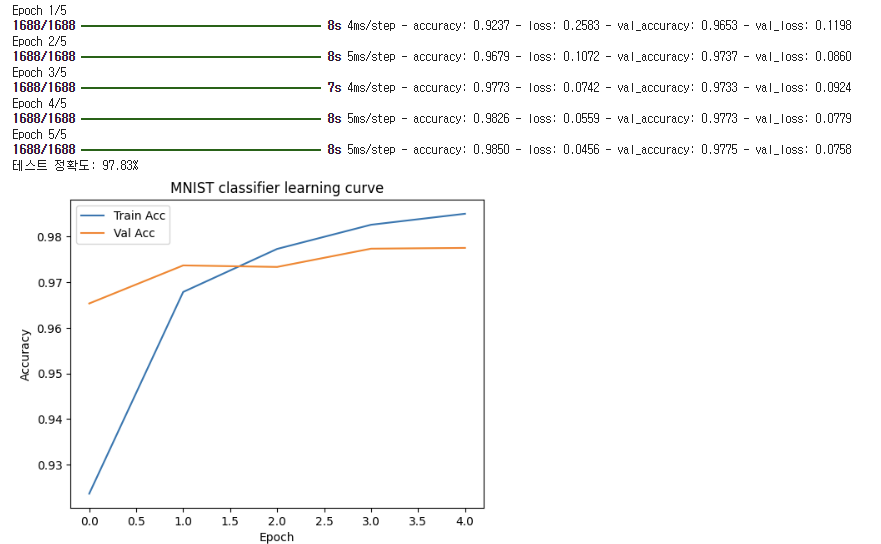
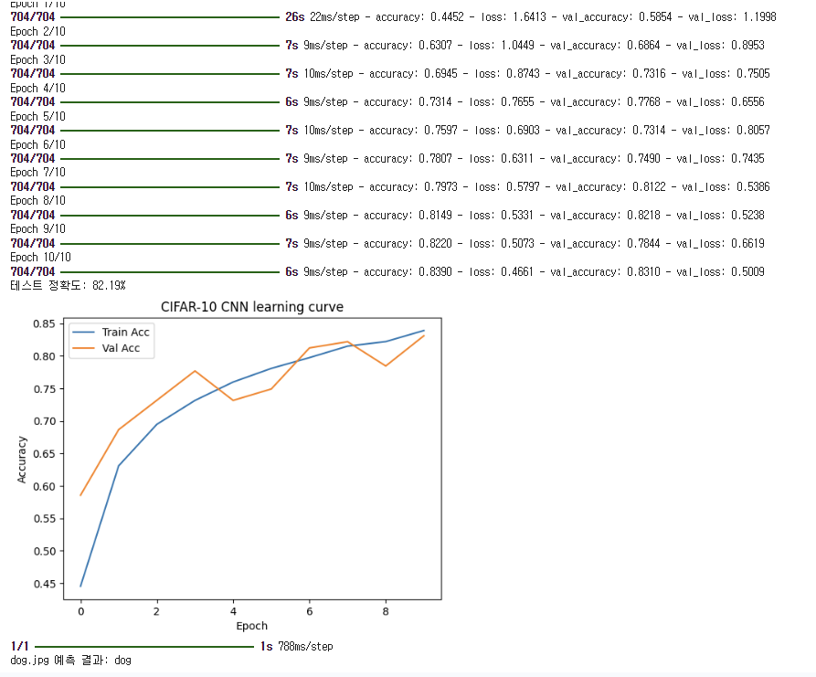

# 딥러닝 이미지 분류 실습 (Chapter 05)

---

## 01. MNIST 손글씨 숫자 분류기 (ImageRecognition01.py)

> **문제 설명**
> - 손글씨 숫자 이미지(MNIST 데이터셋)를 이용하여 간단한 신경망 분류기를 구현합니다.
> - 신경망을 훈련시키고, 테스트 데이터에 대한 분류 정확도를 평가합니다.

**핵심 개념 및 자세한 설명**
- **MNIST 데이터셋**: 28x28 픽셀의 흑백 손글씨 숫자(0~9) 이미지 7만장(훈련 6만, 테스트 1만)
- **신경망(MLP)**: 입력층(784), 은닉층(128, 64), 출력층(10, softmax)
- **정규화**: 픽셀값을 0~1로 변환해 학습 효율 향상
- **학습/검증 분리**: validation_split=0.1로 일부 데이터를 검증에 사용
- **정확도 평가**: 테스트셋으로 모델 성능 측정
- **학습 곡선 시각화**: 학습/검증 정확도 변화 그래프

**전체 코드**
<details>
<summary>펼치기/접기</summary>

```python
import tensorflow as tf  # 텐서플로우 라이브러리 임포트
from tensorflow.keras import layers, models  # 케라스의 레이어, 모델 임포트
from tensorflow.keras.datasets import mnist  # MNIST 데이터셋 임포트
import matplotlib.pyplot as plt  # 그래프 시각화 라이브러리

# 1. 데이터 로드 및 전처리
(x_train, y_train), (x_test, y_test) = mnist.load_data()  # MNIST 데이터셋 불러오기
x_train = x_train.reshape(-1, 28*28).astype('float32') / 255.0  # 훈련 이미지 1차원화 및 정규화
x_test = x_test.reshape(-1, 28*28).astype('float32') / 255.0    # 테스트 이미지 1차원화 및 정규화

# 2. 모델 구성
model = models.Sequential([  # 순차적 신경망 모델 생성
    layers.Input(shape=(28*28,)),  # 입력층: 784차원(28x28)
    layers.Dense(128, activation='relu'),  # 은닉층1: 128개 노드, ReLU 활성화
    layers.Dense(64, activation='relu'),   # 은닉층2: 64개 노드, ReLU 활성화
    layers.Dense(10, activation='softmax') # 출력층: 10개(0~9), 소프트맥스
])

# 3. 컴파일 및 훈련
model.compile(optimizer='adam', loss='sparse_categorical_crossentropy', metrics=['accuracy'])  # 모델 컴파일(최적화/손실/평가지표)
history = model.fit(x_train, y_train, epochs=5, batch_size=32, validation_split=0.1)  # 모델 훈련(5에폭, 미니배치 32, 검증 10%)

# 4. 평가
loss, acc = model.evaluate(x_test, y_test, verbose=0)  # 테스트 데이터로 평가
print(f"테스트 정확도: {acc*100:.2f}%")  # 정확도 출력

# 5. 학습 곡선 시각화
plt.plot(history.history['accuracy'], label='Train Acc')  # 학습 정확도 곡선
plt.plot(history.history['val_accuracy'], label='Val Acc')  # 검증 정확도 곡선
plt.xlabel('Epoch')  # x축: 에폭
plt.ylabel('Accuracy')  # y축: 정확도
plt.legend()  # 범례 표시
plt.title('MNIST 분류기 학습 곡선')  # 그래프 제목
plt.show()  # 그래프 출력
```
</details>

**핵심 코드**
```python
model = models.Sequential([
    layers.Input(shape=(28*28,)),
    layers.Dense(128, activation='relu'),
    layers.Dense(64, activation='relu'),
    layers.Dense(10, activation='softmax')
])
```

**결과물**
<div style="display: flex; flex-direction: row; gap: 20px;">
  <div style="text-align: center;">
    <b>03. SIFT Homography Alignment</b><br>
    
  </div>
</div>

---

## 02. CIFAR-10 CNN 이미지 분류기 (ImageRecognition02.py)

> **문제 설명**
> - CIFAR-10 데이터셋을 활용하여 합성곱신경망(CNN)으로 10종 이미지 분류를 수행합니다.
> - 모델을 훈련시키고, 테스트 이미지(dog.jpg)에 대한 예측도 수행합니다.

**핵심 개념 및 자세한 설명**
- **CIFAR-10 데이터셋**: 32x32 컬러 이미지 6만장(10종: 비행기, 자동차, 새, 고양이, 사슴, 개, 개구리, 말, 배, 트럭)
- **CNN 구조**: Conv2D, BatchNormalization, MaxPooling2D, Dropout, Flatten, Dense 레이어 활용
- **정규화**: 픽셀값을 0~1로 변환
- **드롭아웃/정규화**: 과적합 방지 및 학습 안정화
- **테스트 이미지 예측**: 외부 이미지를 불러와 분류 결과 출력

**전체 코드**
<details>
<summary>펼치기/접기</summary>

```python
import tensorflow as tf  # 텐서플로우 임포트
from tensorflow.keras import layers, models  # 케라스 레이어, 모델 임포트
from tensorflow.keras.datasets import cifar10  # CIFAR-10 데이터셋 임포트
import numpy as np  # 넘파이 임포트
import matplotlib.pyplot as plt  # 그래프 시각화

# 1. 데이터 로드 및 전처리
(x_train, y_train), (x_test, y_test) = cifar10.load_data()  # CIFAR-10 데이터셋 불러오기
x_train = x_train.astype('float32') / 255.0  # 훈련 이미지 정규화
x_test = x_test.astype('float32') / 255.0    # 테스트 이미지 정규화

# 2. CNN 모델 구성 (성능 개선)
model = models.Sequential([
    layers.Conv2D(32, (3,3), padding='same', activation='relu', input_shape=(32,32,3)),  # 합성곱층1
    layers.BatchNormalization(),  # 배치 정규화
    layers.Conv2D(32, (3,3), padding='same', activation='relu'),  # 합성곱층2
    layers.BatchNormalization(),
    layers.MaxPooling2D((2,2)),  # 풀링층1
    layers.Dropout(0.25),        # 드롭아웃1

    layers.Conv2D(64, (3,3), padding='same', activation='relu'),  # 합성곱층3
    layers.BatchNormalization(),
    layers.Conv2D(64, (3,3), padding='same', activation='relu'),  # 합성곱층4
    layers.BatchNormalization(),
    layers.MaxPooling2D((2,2)),  # 풀링층2
    layers.Dropout(0.25),        # 드롭아웃2

    layers.Conv2D(128, (3,3), padding='same', activation='relu'), # 합성곱층5
    layers.BatchNormalization(),
    layers.Conv2D(128, (3,3), padding='same', activation='relu'), # 합성곱층6
    layers.BatchNormalization(),
    layers.MaxPooling2D((2,2)),  # 풀링층3
    layers.Dropout(0.25),        # 드롭아웃3

    layers.Flatten(),  # 1차원 변환
    layers.Dense(256, activation='relu'),  # 완전연결층
    layers.BatchNormalization(),
    layers.Dropout(0.5),  # 드롭아웃4
    layers.Dense(10, activation='softmax')  # 출력층(10개 클래스)
])

# 3. 컴파일 및 훈련
model.compile(optimizer='adam', loss='sparse_categorical_crossentropy', metrics=['accuracy'])  # 모델 컴파일
history = model.fit(x_train, y_train, epochs=10, batch_size=64, validation_split=0.1)  # 모델 훈련

# 4. 평가
loss, acc = model.evaluate(x_test, y_test, verbose=0)  # 테스트 데이터 평가
print(f"테스트 정확도: {acc*100:.2f}%")  # 정확도 출력

# 5. 학습 곡선 시각화
plt.plot(history.history['accuracy'], label='Train Acc')  # 학습 정확도 곡선
plt.plot(history.history['val_accuracy'], label='Val Acc')  # 검증 정확도 곡선
plt.xlabel('Epoch')  # x축: 에폭
plt.ylabel('Accuracy')  # y축: 정확도
plt.legend()  # 범례
plt.title('CIFAR-10 CNN learning curve')  # 그래프 제목
plt.show()  # 그래프 출력

# 6. 테스트 이미지(dog.jpg) 예측 (파일이 있을 경우)
import os  # OS 라이브러리
from tensorflow.keras.preprocessing import image  # 이미지 전처리

img_path = 'chapter05/dog.jpg'  # 예측할 이미지 경로
if os.path.exists(img_path):  # 파일 존재 여부 확인
    img = image.load_img(img_path, target_size=(32,32))  # 이미지 로드 및 크기 변환
    img_array = image.img_to_array(img) / 255.0  # 배열 변환 및 정규화
    img_array = np.expand_dims(img_array, axis=0)  # 배치 차원 추가
    pred = model.predict(img_array)  # 예측
    class_idx = np.argmax(pred)  # 예측 클래스 인덱스
    class_names = ['airplane','automobile','bird','cat','deer','dog','frog','horse','ship','truck']  # 클래스명
    print(f"dog.jpg 예측 결과: {class_names[class_idx]}")  # 예측 결과 출력
else:
    print("dog.jpg 파일이 chapter05 폴더에 없습니다.")  # 파일 없을 때 메시지
```
</details>

**핵심 코드**
```python
layers.Conv2D(32, (3,3), padding='same', activation='relu', input_shape=(32,32,3))
layers.BatchNormalization()
layers.MaxPooling2D((2,2))
layers.Dropout(0.25)
```

**결과물 예시**
<div style="display: flex; flex-direction: row; gap: 20px;">
  <div style="text-align: center;">
    <b>03. SIFT Homography Alignment</b><br>
    
  </div>
</div>


---

## 참고 및 실행법
- 각 코드에는 한 줄씩 상세한 한글 주석이 포함되어 있어, 초보자도 쉽게 이해할 수 있습니다.
- 필요한 라이브러리: tensorflow, matplotlib, numpy
- 실행 예시:
  ```bash
  python ImageRecognition01.py
  python ImageRecognition02.py
  ```
- GPU 환경에서 실행하면 학습 속도가 더 빨라집니다.
