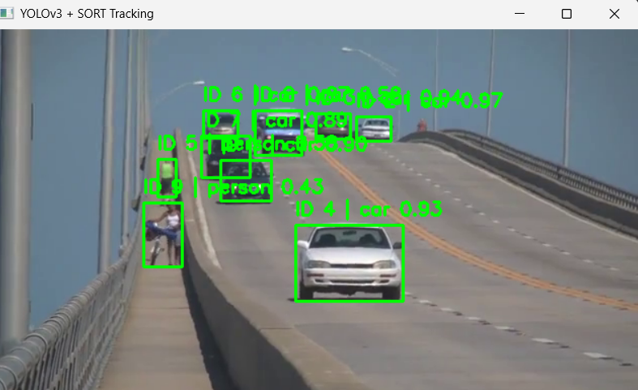

# 객체 탐지 및 얼굴 랜드마크 실습 (Chapter 06)

---

## 01. YOLOv3 + SORT 다중 객체 추적 (01_SORT_MOT.py)

> **문제 설명**
> - 동영상 파일(slow_traffic_small.mp4)을 프레임 단위로 읽어 객체를 탐지합니다.
> - YOLOv3로 객체를 검출하고, SORT로 프레임 간 동일 객체를 추적하여 고유 ID를 유지합니다.
> - 화면에 바운딩 박스, 추적 ID, 클래스명을 실시간으로 표시합니다.

**핵심 개념 및 자세한 설명**
- **YOLOv3 객체 탐지**: OpenCV DNN 모듈로 yolov3.cfg와 yolov3.weights를 로드해 프레임에서 객체를 검출합니다.
- **Confidence 계산**: objectness와 class score를 곱해 신뢰도를 계산하고 임계값(CONF_THRESHOLD) 이상만 사용합니다.
- **NMS(Non-Maximum Suppression)**: 중복되는 박스를 제거해 안정적인 검출 결과를 만듭니다.
- **SORT 추적**: Kalman Filter와 IoU 기반 매칭으로 객체별 ID를 유지합니다.
- **라벨 매칭**: 추적 박스와 검출 박스의 IoU를 계산해 가장 맞는 클래스 라벨을 추적 결과에 붙입니다.
- **루프 재생**: 영상 끝에 도달하면 첫 프레임으로 되돌려 반복 재생합니다.

**전체 코드**
<details>
<summary>펼치기/접기</summary>

```python
import cv2  # OpenCV 라이브러리를 임포트합니다.
import numpy as np  # 수치 연산을 위한 NumPy를 임포트합니다.
import os  # 파일 경로 처리를 위한 os 모듈을 임포트합니다.

from sort import Sort  # SORT 추적기 클래스를 가져옵니다.


# 차량 클래스만 사용하려면 True로 변경합니다.
USE_ONLY_VEHICLES = False  # 현재는 전체 클래스를 대상으로 탐지/추적합니다.

VEHICLE_CLASSES = []  # 차량 전용 필터를 쓸 때 사용할 클래스 이름 목록입니다.
# YOLOv3 설정
##############################
YOLO_CFG = os.path.join(os.path.dirname(__file__), 'yolov3.cfg')  # YOLO 설정 파일 경로입니다.
YOLO_WEIGHTS = os.path.join(os.path.dirname(__file__), 'yolov3.weights')  # YOLO 가중치 파일 경로입니다.
COCO_NAMES = os.path.join(os.path.dirname(__file__), 'coco.names')  # 클래스 이름 파일 경로입니다.

CONF_THRESHOLD = 0.3  # 신뢰도 임계값입니다.
NMS_THRESHOLD = 0.4  # NMS 임계값입니다.


##############################
# 클래스 이름 로드
##############################
def load_classes(names_path):  # 클래스 이름 파일을 읽는 함수입니다.
  with open(names_path, 'r') as f:  # 파일을 읽기 모드로 엽니다.
    classes = [line.strip() for line in f.readlines()]  # 각 줄의 공백/개행을 제거해 리스트로 만듭니다.
  return classes  # 클래스 이름 리스트를 반환합니다.


##############################
# YOLO 네트워크 로드
##############################
def load_yolo(cfg, weights):  # YOLO 모델을 로드하는 함수입니다.

  net = cv2.dnn.readNetFromDarknet(cfg, weights)  # Darknet 형식 cfg/weights를 읽어 네트워크를 생성합니다.

  net.setPreferableBackend(cv2.dnn.DNN_BACKEND_OPENCV)  # OpenCV DNN 백엔드를 사용합니다.
  net.setPreferableTarget(cv2.dnn.DNN_TARGET_CPU)  # CPU 타깃으로 추론을 수행합니다.

  return net  # 로드된 네트워크 객체를 반환합니다.


##############################
# IoU 계산
##############################
def compute_iou(boxA, boxB):  # 두 박스의 IoU를 계산하는 함수입니다.

  xA = max(boxA[0], boxB[0])  # 교집합 좌상단 x를 계산합니다.
  yA = max(boxA[1], boxB[1])  # 교집합 좌상단 y를 계산합니다.
  xB = min(boxA[2], boxB[2])  # 교집합 우하단 x를 계산합니다.
  yB = min(boxA[3], boxB[3])  # 교집합 우하단 y를 계산합니다.

  interW = max(0, xB - xA)  # 교집합 너비를 계산합니다.
  interH = max(0, yB - yA)  # 교집합 높이를 계산합니다.

  interArea = interW * interH  # 교집합 면적을 계산합니다.

  boxAArea = (boxA[2] - boxA[0]) * (boxA[3] - boxA[1])  # A 박스 면적을 계산합니다.
  boxBArea = (boxB[2] - boxB[0]) * (boxB[3] - boxB[1])  # B 박스 면적을 계산합니다.

  union = boxAArea + boxBArea - interArea  # 합집합 면적을 계산합니다.

  if union == 0:  # 0으로 나누는 상황을 방지합니다.
    return 0  # 합집합이 0이면 IoU를 0으로 반환합니다.

  return interArea / union  # 최종 IoU를 반환합니다.


##############################
# 객체 검출 함수
##############################
def detect_objects(net, frame, conf_threshold, nms_threshold, classes):  # 프레임에서 객체를 검출하는 함수입니다.

  h, w = frame.shape[:2]  # 프레임의 높이/너비를 가져옵니다.

  blob = cv2.dnn.blobFromImage(  # YOLO 입력용 blob을 생성합니다.
    frame,  # 입력 프레임입니다.
    1 / 255.0,  # 픽셀 값을 0~1로 정규화합니다.
    (608, 608),  # YOLO 입력 크기입니다.
    swapRB=True,  # BGR을 RGB로 변환합니다.
    crop=False  # 크롭 없이 리사이즈합니다.
  )

  net.setInput(blob)  # 네트워크 입력으로 blob을 설정합니다.

  layer_names = net.getLayerNames()  # 전체 레이어 이름을 가져옵니다.
  output_layers = [layer_names[i - 1] for i in net.getUnconnectedOutLayers().flatten()]  # 출력 레이어 이름을 추출합니다.

  outputs = net.forward(output_layers)  # 출력 레이어 추론을 실행합니다.

  boxes = []  # 박스 좌표를 담을 리스트입니다.
  confidences = []  # 신뢰도를 담을 리스트입니다.
  class_ids = []  # 클래스 인덱스를 담을 리스트입니다.

  for output in outputs:  # 각 출력 텐서를 순회합니다.
    for detection in output:  # 각 검출 결과를 순회합니다.

      scores = detection[5:]  # 클래스별 점수 벡터를 추출합니다.
      class_id = np.argmax(scores)  # 가장 높은 점수의 클래스 인덱스를 구합니다.
      confidence = float(detection[4] * scores[class_id])  # objectness와 클래스 점수를 곱해 최종 신뢰도를 계산합니다.

      if confidence > conf_threshold:  # 신뢰도 임계값 이상만 사용합니다.

        box = detection[0:4] * np.array([w, h, w, h])  # 정규화된 박스를 픽셀 좌표로 변환합니다.

        (centerX, centerY, width, height) = box.astype("int")  # 중심/너비/높이를 정수로 변환합니다.

        x = int(centerX - (width / 2))  # 좌상단 x를 계산합니다.
        y = int(centerY - (height / 2))  # 좌상단 y를 계산합니다.

        boxes.append([x, y, int(width), int(height)])  # NMS용 박스를 저장합니다.
        confidences.append(confidence)  # 신뢰도를 저장합니다.
        class_ids.append(class_id)  # 클래스 인덱스를 저장합니다.

  idxs = cv2.dnn.NMSBoxes(  # NMS를 적용해 중복 박스를 제거합니다.
    boxes,  # 입력 박스 목록입니다.
    confidences,  # 입력 신뢰도 목록입니다.
    conf_threshold,  # 점수 임계값입니다.
    nms_threshold  # NMS 임계값입니다.
  )

  results = []  # 최종 검출 결과를 담을 리스트입니다.

  if len(idxs) > 0:  # 남은 박스가 있으면 처리합니다.
    for i in idxs.flatten():  # 선택된 인덱스를 순회합니다.

      x, y, w_box, h_box = boxes[i]  # 박스 좌표/크기를 꺼냅니다.

      x1 = x  # 좌상단 x를 설정합니다.
      y1 = y  # 좌상단 y를 설정합니다.
      x2 = x + w_box  # 우하단 x를 계산합니다.
      y2 = y + h_box  # 우하단 y를 계산합니다.

      results.append([  # [x1, y1, x2, y2, score, class_id] 형식으로 저장합니다.
        x1,  # 좌상단 x입니다.
        y1,  # 좌상단 y입니다.
        x2,  # 우하단 x입니다.
        y2,  # 우하단 y입니다.
        confidences[i],  # 신뢰도입니다.
        class_ids[i]  # 클래스 인덱스입니다.
      ])

  return results  # 최종 검출 결과를 반환합니다.


##############################
# 메인
##############################
def main():  # 프로그램 메인 함수입니다.

  print("YOLO 로딩 중...")  # 모델 로딩 시작 로그를 출력합니다.

  classes = load_classes(COCO_NAMES)  # 클래스 이름 목록을 로드합니다.

  net = load_yolo(YOLO_CFG, YOLO_WEIGHTS)  # YOLO 네트워크를 로드합니다.

  tracker = Sort(  # SORT 추적기를 생성합니다.
    max_age=30,  # 매칭 실패 후 유지할 최대 프레임 수입니다.
    min_hits=1,  # 트랙 확정 최소 히트 수입니다.
    iou_threshold=0.3  # 매칭에 사용할 IoU 임계값입니다.
  )

  print("비디오 로딩 중...")  # 비디오 로딩 시작 로그를 출력합니다.

  video_path = os.path.join(  # 비디오 파일 절대 경로를 만듭니다.
    os.path.dirname(__file__),  # 현재 스크립트 디렉터리입니다.
    "slow_traffic_small.mp4"  # 입력 비디오 파일 이름입니다.
  )

  cap = cv2.VideoCapture(video_path)  # 비디오 캡처 객체를 생성합니다.

  if not cap.isOpened():  # 비디오가 열리지 않으면
    print("비디오 열기 실패")  # 실패 메시지를 출력하고
    return  # 함수를 종료합니다.

  while True:  # 영상 끝까지 반복 처리합니다.

    ret, frame = cap.read()  # 프레임 하나를 읽습니다.

    if not ret:  # 프레임 읽기에 실패하면(영상 끝 등)
      cap.set(cv2.CAP_PROP_POS_FRAMES, 0)  # 재생 위치를 처음 프레임으로 되돌립니다.
      continue  # 다음 루프로 넘어가 반복 재생합니다.

    ###################################
    # YOLO 객체 검출
    ###################################
    detections = detect_objects(  # 현재 프레임에서 객체를 검출합니다.
      net,  # YOLO 네트워크입니다.
      frame,  # 현재 프레임입니다.
      CONF_THRESHOLD,  # 신뢰도 임계값입니다.
      NMS_THRESHOLD,  # NMS 임계값입니다.
      classes  # 클래스 이름 목록입니다.
    )

    ###################################
    # SORT 입력 형태로 변환
    ###################################
    dets_for_sort = np.array([  # SORT 입력 포맷 [x1, y1, x2, y2, score] 배열로 변환합니다.
      [x1, y1, x2, y2, score]  # class_id는 제외하고 좌표+점수만 사용합니다.
      for x1, y1, x2, y2, score, _ in detections  # 검출 결과를 순회합니다.
    ])

    if len(dets_for_sort) == 0:  # 검출 결과가 없으면
      dets_for_sort = np.empty((0, 5))  # SORT가 요구하는 빈 입력 형태로 만듭니다.

    ###################################
    # 추적 수행
    ###################################
    tracks = tracker.update(dets_for_sort)  # 현재 프레임에서 객체 추적을 갱신합니다.

    ###################################
    # 결과 시각화
    ###################################
    for track in tracks:  # 추적 결과를 하나씩 순회합니다.

      x1, y1, x2, y2, track_id = track.astype(int)  # 추적 박스 좌표와 ID를 정수로 변환합니다.

      best_label = ""  # 현재 트랙에 매칭된 최적 라벨 문자열입니다.
      best_iou = 0  # 현재 트랙과 검출 간 최대 IoU 값입니다.

      for det in detections:  # 검출 결과를 순회하며 가장 잘 맞는 라벨을 찾습니다.

        iou = compute_iou(track[:4], det[:4])  # 트랙 박스와 검출 박스 IoU를 계산합니다.

        if iou > best_iou:  # 더 높은 IoU를 찾으면

          class_id = int(det[5])  # 해당 검출의 클래스 인덱스를 가져옵니다.
          score = det[4]  # 해당 검출의 신뢰도를 가져옵니다.

          best_label = f"{classes[class_id]} {score:.2f}"  # 표시할 라벨 문자열을 갱신합니다.
          best_iou = iou  # 최대 IoU를 갱신합니다.

      cv2.rectangle(  # 추적 박스를 프레임에 그립니다.
        frame,  # 출력 프레임입니다.
        (x1, y1),  # 좌상단 좌표입니다.
        (x2, y2),  # 우하단 좌표입니다.
        (0, 255, 0),  # 녹색 색상입니다.
        2  # 선 두께입니다.
      )

      cv2.putText(  # ID와 라벨 텍스트를 프레임에 표시합니다.
        frame,  # 출력 프레임입니다.
        f"ID {track_id} | {best_label}",  # 표시할 문자열입니다.
        (x1, y1 - 10),  # 텍스트 시작 위치입니다.
        cv2.FONT_HERSHEY_SIMPLEX,  # 폰트 종류입니다.
        0.6,  # 폰트 크기입니다.
        (0, 255, 0),  # 글자 색상입니다.
        2  # 글자 두께입니다.
      )

    ###################################
    # 화면 출력
    ###################################
    cv2.imshow(  # 결과 영상을 창에 표시합니다.
      "YOLOv3 + SORT Tracking",  # 창 제목입니다.
      frame  # 표시할 프레임입니다.
    )

    key = cv2.waitKey(1)  # 1ms 키 입력을 대기합니다.

    if key == 27:  # ESC 키를 누르면
      break  # 루프를 종료합니다.

  cap.release()  # 비디오 캡처 리소스를 해제합니다.
  cv2.destroyAllWindows()  # OpenCV 창을 모두 닫습니다.


if __name__ == "__main__":  # 이 파일을 직접 실행한 경우
  main()  # 메인 함수를 호출합니다.
```
</details>

**핵심 코드**
```python
# 1) 프레임에서 객체 검출
detections = detect_objects(
    net,
    frame,
    CONF_THRESHOLD,
    NMS_THRESHOLD,
    classes
)

# 2) SORT 입력 형식으로 변환
# [x1, y1, x2, y2, score]
dets_for_sort = np.array([
    [x1, y1, x2, y2, score]
    for x1, y1, x2, y2, score, _ in detections
])
if len(dets_for_sort) == 0:
    dets_for_sort = np.empty((0, 5))

# 3) 추적 업데이트
tracks = tracker.update(dets_for_sort)
```

**결과물**
<div style="display: flex; flex-direction: row; gap: 20px;">
  <div style="text-align: center;">
    <b>01. YOLOv3 + SORT Tracking</b><br>
    
  </div>
</div>

---

## 02. MediaPipe Face Mesh 실시간 랜드마크 (02_Mediapipe_FaceMesh.py)

> **문제 설명**
> - 웹캠(기본 카메라)을 사용해 얼굴을 실시간으로 인식합니다.
> - MediaPipe Face Landmarker 모델(face_landmarker.task)로 얼굴 랜드마크를 추론합니다.
> - 얼굴 주요 포인트를 프레임 위에 점으로 시각화합니다.

**핵심 개념 및 자세한 설명**
- **MediaPipe Tasks API**: FaceLandmarkerOptions로 모델 경로/옵션을 설정하고 FaceLandmarker 인스턴스를 생성합니다.
- **BGR -> RGB 변환**: OpenCV 프레임(BGR)을 MediaPipe 입력 형식(RGB)으로 변환합니다.
- **정규화 좌표 변환**: 랜드마크 좌표(lm.x, lm.y)는 0~1 범위이므로 프레임 크기에 맞게 픽셀 좌표로 변환합니다.
- **실시간 렌더링**: 검출된 각 랜드마크를 초록색 점으로 그려 얼굴 윤곽/특징점을 시각화합니다.
- **모델 파일 체크**: 실행 전 face_landmarker.task 파일 존재 여부를 확인해 사용자 오류를 줄입니다.

**전체 코드**
<details>
<summary>펼치기/접기</summary>

```python
# 운영체제 경로 처리를 위한 os 모듈을 가져옵니다.
import os
# 영상 캡처 및 화면 표시를 위한 OpenCV를 가져옵니다.
import cv2
# MediaPipe 이미지 객체 생성을 위해 mediapipe를 가져옵니다.
import mediapipe as mp
# MediaPipe Tasks의 파이썬 베이스 API를 가져옵니다.
from mediapipe.tasks import python
# FaceLandmarker 비전 태스크 API를 가져옵니다.
from mediapipe.tasks.python import vision

# 현재 파일과 같은 폴더에 있는 모델 파일 경로를 만듭니다.
MODEL_PATH = os.path.join(os.path.dirname(__file__), "face_landmarker.task")


# 프로그램의 메인 실행 함수를 정의합니다.
def main() -> None:
  # 모델 파일이 존재하지 않으면 안내 메시지를 출력합니다.
  if not os.path.exists(MODEL_PATH):
    # 누락된 모델 파일 경로를 사용자에게 보여줍니다.
    print("모델 파일이 없습니다:", MODEL_PATH)
    # 모델 파일을 어디에 둬야 하는지 안내합니다.
    print("face_landmarker.task 파일을 chapter06 폴더에 두고 다시 실행하세요.")
    # 모델이 없으므로 함수를 종료합니다.
    return

  # 얼굴 랜드마커 옵션 객체를 생성합니다.
  options = vision.FaceLandmarkerOptions(
    # 로컬 모델 파일 경로를 베이스 옵션에 설정합니다.
    base_options=python.BaseOptions(model_asset_path=MODEL_PATH),
    # 한 프레임에서 최대 1개의 얼굴만 처리합니다.
    num_faces=1,
    # 블렌드셰이프 출력은 사용하지 않습니다.
    output_face_blendshapes=False,
    # 얼굴 변환 행렬 출력은 사용하지 않습니다.
    output_facial_transformation_matrixes=False,
  )

  # 기본 카메라(인덱스 0)를 엽니다.
  cap = cv2.VideoCapture(0)
  # 카메라를 열지 못하면 오류 메시지를 출력합니다.
  if not cap.isOpened():
    # 웹캠 접근 실패 메시지를 출력합니다.
    print("웹캠을 열 수 없습니다.")
    # 카메라가 없으므로 함수를 종료합니다.
    return

  # 옵션으로 FaceLandmarker를 생성하고 블록 종료 시 자동 해제합니다.
  with vision.FaceLandmarker.create_from_options(options) as landmarker:
    # 종료 조건(ESC) 전까지 프레임을 계속 처리합니다.
    while True:
      # 카메라에서 한 프레임을 읽습니다.
      ret, frame = cap.read()
      # 프레임 읽기에 실패하면 루프를 종료합니다.
      if not ret:
        # 프레임 획득 실패 메시지를 출력합니다.
        print("카메라에서 영상을 읽을 수 없습니다.")
        # 더 이상 처리할 수 없어 반복을 중단합니다.
        break

      # OpenCV의 BGR 프레임을 MediaPipe 입력용 RGB로 변환합니다.
      rgb = cv2.cvtColor(frame, cv2.COLOR_BGR2RGB)
      # RGB numpy 배열을 MediaPipe Image 객체로 감쌉니다.
      mp_image = mp.Image(image_format=mp.ImageFormat.SRGB, data=rgb)
      # 현재 프레임에서 얼굴 랜드마크를 검출합니다.
      result = landmarker.detect(mp_image)

      # 랜드마크 결과가 있으면 점을 그립니다.
      if result.face_landmarks:
        # 좌표 변환을 위해 프레임의 높이와 너비를 가져옵니다.
        h, w, _ = frame.shape
        # 검출된 각 얼굴의 랜드마크 집합을 순회합니다.
        for landmarks in result.face_landmarks:
          # 해당 얼굴의 모든 랜드마크 포인트를 순회합니다.
          for lm in landmarks:
            # 정규화된 x 좌표를 픽셀 좌표로 변환합니다.
            x = int(lm.x * w)
            # 정규화된 y 좌표를 픽셀 좌표로 변환합니다.
            y = int(lm.y * h)
            # 유효한 화면 범위 안의 점만 그립니다.
            if 0 <= x < w and 0 <= y < h:
              # 랜드마크 위치에 초록색 점을 표시합니다.
              cv2.circle(frame, (x, y), 1, (0, 255, 0), -1)

      # 랜드마크가 그려진 프레임을 화면에 표시합니다.
      cv2.imshow("MediaPipe Face Landmarks", frame)
      # ESC(27) 키가 눌리면 루프를 종료합니다.
      if cv2.waitKey(1) & 0xFF == 27:
        # 사용자 종료 요청에 따라 반복을 중단합니다.
        break

  # 카메라 자원을 해제합니다.
  cap.release()
  # OpenCV 창을 모두 닫습니다.
  cv2.destroyAllWindows()


# 이 파일이 직접 실행될 때 main 함수를 호출합니다.
if __name__ == "__main__":
  # 메인 로직을 실행합니다.
  main()
```
</details>

**핵심 코드**
```python
options = vision.FaceLandmarkerOptions(
    base_options=python.BaseOptions(model_asset_path=MODEL_PATH),
    num_faces=1,
    output_face_blendshapes=False,
    output_facial_transformation_matrixes=False,
)

rgb = cv2.cvtColor(frame, cv2.COLOR_BGR2RGB)
mp_image = mp.Image(image_format=mp.ImageFormat.SRGB, data=rgb)
result = landmarker.detect(mp_image)

if result.face_landmarks:
    h, w, _ = frame.shape
    for landmarks in result.face_landmarks:
        for lm in landmarks:
            x = int(lm.x * w)
            y = int(lm.y * h)
            if 0 <= x < w and 0 <= y < h:
                cv2.circle(frame, (x, y), 1, (0, 255, 0), -1)
```

**결과물**
<div style="display: flex; flex-direction: row; gap: 20px;">
  <div style="text-align: center;">
    <b>02. MediaPipe Face Landmarks</b><br>
    
  </div>
</div>

---

## 참고 및 실행법
- 필요한 라이브러리: opencv-python, numpy, mediapipe, filterpy, scipy
- 실행 전 파일 확인:
  - 01_SORT_MOT.py용: yolov3.cfg, yolov3.weights, coco.names, slow_traffic_small.mp4
  - 02_Mediapipe_FaceMesh.py용: face_landmarker.task

실행 예시:
```bash
python chapter06/01_SORT_MOT.py
python chapter06/02_Mediapipe_FaceMesh.py
```

추가 참고:
- 01_SORT_MOT.py는 ESC 키로 종료할 수 있습니다.
- 02_Mediapipe_FaceMesh.py는 웹캠 접근 권한이 필요합니다.
